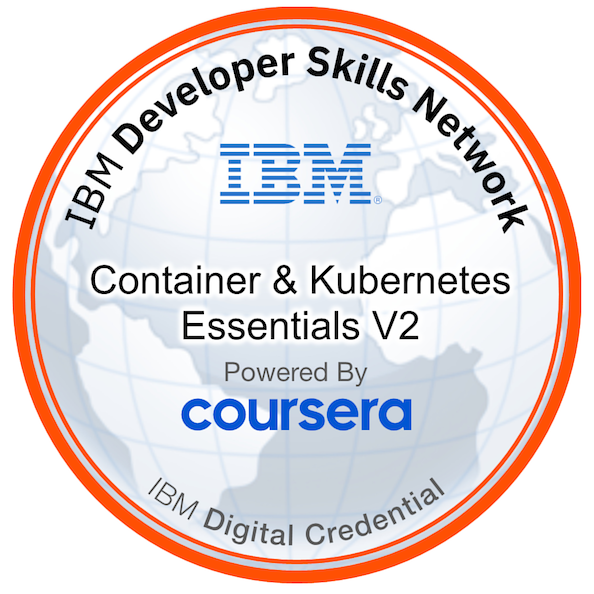

[<=](../index.md) |
[Course content online]()
___

- [Understanding the Benefits of Containers](#understanding-the-benefits-of-containers)
  - [Course Introduction](#course-introduction)
  - [Introduction to Containers](#introduction-to-containers)
  - [Introduction to Docker](#introduction-to-docker)
  - [Building Container Images](#building-container-images)
  - [Container Registries](#container-registries)
  - [Running Containers](#running-containers)
  - [Lab 1: Introduction to Containers, Docker, and IBM Cloud Container Registry](#lab-1-introduction-to-containers-docker-and-ibm-cloud-container-registry)
  - [CheatSheet - Docker CLI](#cheatsheet---docker-cli)
  - [Glossary - Container Basics](#glossary---container-basics)
  - [Lab 2: Creating an IBM Cloud Container Registry Namespace](#lab-2-creating-an-ibm-cloud-container-registry-namespace)
- [Understanding Kubernetes Architecture](#understanding-kubernetes-architecture)
  - [Container Orchestration](#container-orchestration)
    - [Container Orchestration (old module)](#container-orchestration-old-module)
  - [Introduction to kubernetes](#introduction-to-kubernetes)
  - [Kubernetes Architecture](#kubernetes-architecture)
    - [Kubernetes Architecture (old module)](#kubernetes-architecture-old-module)
  - [Kubernetes Objects – Part 1](#kubernetes-objects--part-1)
  - [Kubernetes Objects – Part 2](#kubernetes-objects--part-2)
  - [Introduction to Kubernetes Objects (old module)](#introduction-to-kubernetes-objects-old-module)
  - [Basic Kubernetes Objects (old module)](#basic-kubernetes-objects-old-module)
  - [Kubectl CLI (old module)](#kubectl-cli-old-module)
  - [Using Kubernetes (old module)](#using-kubernetes-old-module)
  - [Using Kubectl](#using-kubectl)
  - [Lab - Introduction to Kubernetes](#lab---introduction-to-kubernetes)
  - [Summary](#summary)
  - [CheatSheet - Understanding Kubernetes Architecture](#cheatsheet---understanding-kubernetes-architecture)
  - [Glossary - Kubernetes Basics](#glossary---kubernetes-basics)
- [Managing Applications with Kubernetes](#managing-applications-with-kubernetes)
  - [Replica Sets (old module)](#replica-sets-old-module)
  - [Replica Sets](#replica-sets)
  - [Autoscaling (old module)](#autoscaling-old-module)
  - [Autoscaling](#autoscaling)
  - [Deployment strategies](#deployment-strategies)
  - [Rolling Updates (old module)](#rolling-updates-old-module)
  - [Rolling Updates](#rolling-updates)
  - [Config Maps and Secrets (old module)](#config-maps-and-secrets-old-module)
  - [Config Maps and Secrets](#config-maps-and-secrets)
  - [Service Binding (old module)](#service-binding-old-module)
  - [Service Binding](#service-binding)
  - [Glossary - Managing Applications with Kubernetes](#glossary---managing-applications-with-kubernetes)
  - [Cheat-sheet: Managing Applications with Kubernetes](#cheat-sheet-managing-applications-with-kubernetes)
- [The Kubernetes Ecosystem](#the-kubernetes-ecosystem)
  - [The Kubernetes Ecosystem (old module)](#the-kubernetes-ecosystem-old-module)
  - [Introduction to Red Hat OpenShift (old module)](#introduction-to-red-hat-openshift-old-module)
  - [Introduction to Red Hat OpenShift](#introduction-to-red-hat-openshift)
  - [Red Hat OpenShift and Kubernetes (old module)](#red-hat-openshift-and-kubernetes-old-module)
  - [Builds (old module)](#builds-old-module)
  - [Builds](#builds)
  - [Operators (old module)](#operators-old-module)
  - [Operators](#operators)
  - [Istio (old module)](#istio-old-module)
  - [Istio](#istio)
  - [Lab](#lab)
  - [Summary](#summary-1)
  - [CheatSheet - The Kubernetes Ecosystem](#cheatsheet---the-kubernetes-ecosystem)
  - [Glossary - The Kubernetes Ecosystem](#glossary---the-kubernetes-ecosystem)
- [Final Project](#final-project)
  - [Resources](#resources)
- [Certificate](#certificate)
- [Badge](#badge)

# Understanding the Benefits of Containers

## Course Introduction

Welcome to this introductory course on Containers and Kubernetes. My name is Alex Parker and I'm Upkar Lidder. This course was made for anybody who wants to learn how to design, develop, deploy, manage secure applications on public, private, and hybrid cloud platforms. By the end of this course you will not only have a running application on public cloud but also have a really good understanding of Kubernetes and Containers. Containerization is not a new technology, but it rose to greater prominence in 2013 with the release of Docker, and it hasn't stopped growing since. In fact, containers have become the technology for modern cloud native development. The analyst firm Gartner predicts that by 2023 over 70 percent of global organizations will be running more than two containerized applications in production, up from less than twenty percent in 2019. The Cloud Native Computing Foundation known as CNCF conducts annual surveys to discern where and how cloud native technologies are being adopted. The 2019 survey indicates that 84 percent of respondents are using containers in production up from 74 percent in 2018; and 23 percent in the first survey in 2016. These trends clearly demonstrate that containers aren't a passing fad or a niche technology but an industry changing revolution that will impact organizations small and large, and developers worldwide. Likewise, Kubernetes, an open source platform for orchestrating running containers was developed and contributed to the open source community by Google in 2015. The Cloud Native Computing Foundation did a survey in 2019 and found that the number of users or respondents who were interested in cloud native computing technologies went up from 58 percent to 78 percent from the previous year. Kubernetes is the third largest platform for number of committers on GitHub as well as second largest for a number of issues and pull requests only after the Linux Kernel. A thriving ecosystem surrounds the open source Kubernetes platform including applications for cloud security, service mesh as well as other cloud native technologies. As a result of these things, Kubernetes and Containers have become the de facto standards when talking about cloud native applications, also making them the foundation for any cloud computing related learning. This course will introduce you to Containers, Docker, and container registries, to get you started with the foundations of this technology. Then you'll learn about the need for container orchestration in Kubernetes specifically, including its architecture, the different resources you can deploy in Kubernetes, and how to put those pieces together to deploy a working application. And finally, you'll learn about the Kubernetes ecosystem, including Red Hat OpenShift and Istio, and how these tools can make your journey to containerization, and your subsequent use of containers so much better. The course contains several hands-on labs that will help you apply the content you learn. If you do not have the resources to set up a Kubernetes cluster, the course will provide an environment free of charge which will help you to finish the labs. The prerequisites for this course include basic computer and cloud literacy, as well as an understanding of core cloud concepts. In addition, understanding of the command line and how to use shell commands will greatly benefit you during this course. Let's get started! Let's get started!

## Introduction to Containers

In this module, we will look at containers. You'll learn what containers are, how they differ from virtual machines, the importance of containers in cloud computing, and the benefits they provide. The tech community is abuzz with words like "containers" and "containerization." This technology has grown immensely in recent years, and it’s poised to continue that growth in the years to come. This course is dedicated to teaching you all about containers. So `what exactly is a container`? **A container is an executable unit of software in which application code is packaged, along with its libraries and dependencies, in common ways so that it can be run anywhere, whether on a desktop, on-premises, or in the cloud**. To do this, containers take advantage of a form of operating system virtualization in which features of the operating system are leveraged to both isolate processes and control the amount of CPU, memory, and disk storage that those processes have access to. In the case of the `Linux kernel`, **namespaces** and **cgroups** are the operating system primitives that enable this virtualization. Containers are small, fast, and portable because unlike a virtual machine, they do not need to include a guest operating system in every instance and can simply leverage the features and resources of the host operating system instead. Containers first appeared decades ago, but the modern container era began in 2013 with the introduction of Docker. Given their name, shipping containers serve as a useful analogy for the containers that we talk about in this course. The shipping industry originally lacked a standardized way to ship goods. As you can see in the first picture, this lack of standardization resulted in a less optimized and more arduous shipping process. To remedy this situation, shipping containers were introduced to standardize the way things are packed and shipped. Now the only thing that can go on a cargo ship is a container. Anything that fits in a shipping container can be shipped. By standardizing, shipping became much more predictable and optimized. The containers we’re talking about in this course are much the same. They are a standardization for how we package and ship software. All the dependencies needed to run an application are packaged with it, making it easy to move it around and run it in a variety of locations. Just as you can ship anything that fits in a container, modern platforms for running containers can run anything as long as it can be packaged as a container. This portability is incredibly useful in software development. The primary advantage of containers, especially compared to a virtual machine, is the level of abstraction they provide that makes them lightweight and portable. Containers are lightweight. They share the machine operating system kernel, eliminating the need for a full operating system instance per application. This makes container files small and less taxing on resources. Their smaller size, especially compared to virtual machines, means they can spin up quickly and are better able to support cloud-native applications that scale horizontally. Containers carry all their dependencies with them, meaning that software can be written once and then run without needing to be re-configured across laptops, cloud, and on-premises computing environments. This portability also provides consistency in your environment so that you don’t have to worry about differing dependencies installed in different environments. The combination of their deployment portability and consistency across platforms and their small size make containers an ideal fit for modern development and application patterns, which expect regular deployments of incremental changes. Like virtual machines before them, containers enable developers and operators to improve the CPU and memory utilization of physical machines. Containers go even further because they also enable a microservice architecture, which means that application components can be deployed and scaled more granularly. This granularity provides an attractive alternative to having to scale up an entire monolithic application when, for example, a single component is struggling with load. Virtual machines provide a useful comparison with containers and help us understand the appeal of containerization. With virtual machines, a hypervisor runs on top of your infrastructure; this hypervisor is responsible for creating virtual machines. It treats resources such as CPU and memory as a pool that can be utilized by the various virtual machines running on the hardware. In this model, the hardware is virtualized so that multiple machines with potentially different operating systems can run on the same physical hardware. As the diagram shows, each virtual machine has its own operating system. In addition, binaries and libraries are present in the virtual machine, which enables the execution of applications. With containers, you still have physical infrastructure at the bottom of the stack. But instead of placing a hypervisor as the next layer to virtualize the hardware, you have an operating system. Above that is the container engine, which, like a hypervisor with virtual machines, is responsible for running containers. In this way, containers virtualize the operating system rather than the infrastructure. This enables the infrastructure to have a single copy of the operating system, which saves a lot of space. The binaries, libraries, and applications run on the container engine. The clear benefit of containers is that you do not have to run a dedicated operating system instance for each virtual environment. Instead, one operating system is virtualized across all the containers. This enables containers to be much more lightweight than virtual machines. While virtual machines can take several seconds or even minutes to start up and can be many gigabytes in size, containers can be only a few megabytes and start in mere seconds or less. Containers are becoming increasingly prominent, especially in cloud environments. Many organizations are even considering containers as a replacement for virtual machines as the general-purpose compute platform for their applications and workloads. But within that very broad scope, there are key use cases where containers are especially relevant. Containers are small and lightweight, which makes them a good match for microservice architectures where applications are constructed of many loosely coupled and independently deployable smaller services. The combination of a microservices architecture and containers is a common foundation for many teams that embrace DevOps as the way they build, ship, and run software. Because containers can run consistently anywhere, across laptop, on-premises, and cloud environments, they are an ideal underlying architecture for hybrid cloud and multi-cloud scenarios, where organizations find themselves operating across a mix of multiple public clouds in combination with their own data centers. Finally, one of the most common approaches to modernizing applications is to begin by containerizing them so that they can be migrated to the cloud. Watch IBM Developer Advocate Sai Vennam explain containerization. Congratulations on finishing the first video in this course. You should now be familiar with the concepts of containers and containerization. Specifically, you should understand what a container is and how it differs from a virtual machine, as well as the benefits that containers provide in software development. In the next video, you’ll learn about Docker and its contributions to containerization. 

## Introduction to Docker

When you hear about containers, you’ll often hear the word "Docker" thrown into the mix. You might hear phrases like “Docker container,” you might recognize the company called Docker, and you might hear Docker referred to as a toolset for working with containers. These are all appropriate uses of the term "Docker," but there are obviously a lot of different meanings out there. Let’s begin this video by describing what each use of these terms means. `Docker` is **a software platform for building and running applications as containers**. Although containerization technology existed long before Docker emerged on the scene, Docker has become inextricably linked to containers. This is because the launch of the Docker open source project in 2013 fueled the rapid growth in popularity of containers and the various technologies and practices that accompany them. Docker provided a straightforward way to build and run containers through an open source platform. This led to an explosion of not only Docker and containerization, but also a myriad of complementary tools, technologies, and development methodologies that still prevail and continue to grow. A Docker image is simply an image that was built using Docker technologies. People often tack the word "Docker" onto “container” and “image” and use “Docker image” and “image” interchangeably. Given the growing ecosystem of container tools, we’ll use the simpler and more general terms “container” and “image” throughout this course. The open source Docker community develops these technologies for the benefit of its users. Docker, the company, builds on the existing open source technologies, contributes back to the community, and provides technologies for enterprise customers. One of the most used tools from Docker is the command line interface, or "CLI." This tool is used extensively in modern software development, and it will also be used in a variety of ways throughout this course. In the course labs, you will have the opportunity to use several Docker commands. Let’s briefly discuss a few of the most common Docker CLI commands. Given appropriate input, the "`docker build`" command is **used to create container images**. Developers provide a "`Dockerfile`," **a file that serves as the blueprint for building a container image**. The "docker build" command takes that file and performs the heavy lifting to build an image. The command also enables users to tag their images, which basically means giving them a name. You can directly tag images using the "`docker tag`" command. **If you have an existing image that you want to rename—for example, if you received the image from someone else, or if you want to store it in another location, you can use the "tag" command to, in effect, copy the image and give the copy a new name**. The "tag" command won’t overwrite the existing image that you have on your machine; it will create a new tag that points to that image. The "`images`" command will **list all the images**, their repositories and tags, and their sizes. Once you build or tag an image, there should be an updated entry in the "docker images" output. This provides a simple way to check that your "build" and "tag" commands executed successfully. As the name indicates, the "`docker run`" command is **used to run a container**. If you are developing container images and you want to test an image that you have developed, you can **run it as a container locally**. The "docker run" command is perfectly suited for this task. Finally, we have the "`push`" and "`pull`" commands. We’ll discuss these commands in more detail in our video on container registries, but for now you simply need to know that **these commands are used for storing images in a remote location and then retrieving those images**. Remember, we’ll get to use all these commands in our labs throughout the course. Docker is also a container runtime. A `container runtime` is **software that executes containers**, much like the "docker run" command that we just referenced. Let’s see how the container runtime fits into a typical stack. As we’ve discussed, we first have the hardware or infrastructure as the bottom layer. This is the physical machine or machines on which our software will run. On top of that we have the operating system. Remember that we said containers share the operating system, rather than just the hardware as virtual machines do. With containers, we have both the hardware and the operating system on the bottom of our stack. Next comes the container runtime, like Docker. Again, this is the layer that will run our containers. Finally, on top, we have the applications that we run as containers. Docker is probably the most popular and best-known container runtime, but Docker has also introduced the "**containerd**" runtime (pronounced "container-dee"), which is quickly gaining popularity. Other runtimes such as **rkt** are also used in the market. Watch IBM Developer Advocate Sai Vennam as he introduces Docker and the benefits of running an application with containers. In this video you’ve learned about the many uses of the word "Docker" and how it applies to the software platform, the company, and the open-source community. In addition, you’ve learned about the Docker CLI and some of the more commonly used commands it provides. Finally, you’ve learned about the Docker container runtime and its place in the containerization stack. In the next video, you’ll learn about building container images with Docker. 

## Building Container Images

Let’s look at what makes up container images, and how we build them. This diagram shows the development process of a running container. A Dockerfile is the blueprint from which an image is built. The Dockerfile outlines all the steps to be taken to build the desired image; Docker then builds that image. It's important to note the difference between a container and an image, which can also be called a container image. These are not interchangeable terms, but rather two distinct things. An `image` is **an immutable file that contains the source code, libraries, and dependencies that are necessary for an application to run**. That immutability means that images are read-only; if you change an image, you create a new image. In a sense, images are templates or blueprints for a container. You can also think of images as snapshots of a container. A container is therefore a running image. Since images are read-only, a write layer is placed on top of images to enable the container to execute. To relate this to object-oriented programming, a container image is like a class, and a container is an instantiated object of that class. As this diagram shows, you begin with a Dockerfile that indicates what to include in an image. You build an image using that Dockerfile. Then, when you run that image, you have a running container. These are the three basic steps in the container development process. Docker can automatically build container images by using the instructions from a Dockerfile. A Dockerfile is simply a text file that contains all the commands a user would call on the command line to create the image. We’ll learn more about them shortly. Docker provides a set of instructions that make this process a bit more straightforward. Images are then built layer by layer, with each Docker instruction creating a new layer on top of the existing layers. It looks something like this. As Docker instructions are run, new read-only layers are created for the image. Depending on the size of an image, there can be a few layers or many. In this example we have four layers. When all the Docker instructions from a Dockerfile have been executed, the image is built and complete. Again, this is a read-only image; making a change would result in a new image. As we just observed, running an image results in a container. When we instantiate this image, we get a running container. At this point, a writeable container layer is added on top of the read-only layers. Remember, containers are not immutable like images are. Containers are running, performing operations, and performing whatever function the developers have written. This writeable layer enables the container to execute its function. Note that layers can be shared between images. If two images have a layer in common, that layer can be used by both images without having to recreate it. This can save a lot of disk space and network bandwidth when sending and receiving images. There are several instructions recognized and provided by Docker for use in Dockerfiles. Any valid Dockerfile must first begin with a FROM instruction, which initializes a new build stage and specifies the base image that subsequent instructions will build upon. This base image is often from a public repository, like an operating system or a base image for a specific language like Go or Node.js. This base image is the starting point for the rest of your image. Let’s go over some other instructions that Docker provides. The RUN instruction executes commands. So, for example, you can put a "bash" command in a RUN instruction to perform a desired action. Each instruction is a new layer added on top of your previous layers. The ENV command enables you to set environment variables in the image. The ADD and COPY commands are similar and enable you to copy files into your image. You would use this to, for example, put your application code or executable into your image. The main difference between these two is that COPY can only copy local files or directories, while ADD can also add files from remote URLs. Then there's the CMD instruction. There can only be one CMD instruction in a Dockerfile. If you include more than one, only the last one will take effect. The main purpose for this instruction is to provide a default for executing a container. This instruction often defines the executable that should run in your container. Let’s have a look at a Dockerfile to see these commands in action. Here is a simple Dockerfile. Note that the first command, as always, is a FROM command. Remember that this command defines the base image. In this case, our base image is Ubuntu version 18.04. This image is freely available on Docker Hub, so we don’t need any authorization and we can also omit the hostname. Next is the COPY command. This command presumes that we have a directory called "app" in our working directory. Assuming that we do, the directory and its contents will be copied into our image as a new layer. The RUN command performs a "make" operation to build the application. Finally, the CMD instruction provides a default mechanism for running this container. In this instance, the Python application will be run. As you can see, Dockerfiles are simple to construct and use. There are more advanced patterns for optimizing your Dockerfiles and building images more efficiently but in general, these basic operations open to you the powerful world of containerization. You should now be familiar with how to build container images using Dockerfiles. You should understand how images are made up of layers and how those layers relate to Dockerfile instructions. You should also know the difference between containers and images. In the next video, you’ll learn about using container registries to store container images. 

## Container Registries

So, we've now learned what containers are. But where do we store and manage them? The answer? Container registries! Container images can be stored on your local machine. If you run the "docker build" command and build a container image, it's now stored on your computer. But this isn’t particularly helpful for distributing that image to others or using it in a staging or production environment. You need a place where container images can be easily stored and retrieved. A `container registry` is used for the **storage and distribution of named container images**. While many features can be built on top of a registry, its most basic function is storing images and allowing someone (or anyone) to later retrieve them. Registries can be public or private. When an image is pushed to a public registry, anyone can pull that image. This is useful for open source projects or personal development where you don’t mind if others use or inspect your images. Most enterprises will opt to use a private registry, which restricts access to the images so that only authorized users can view and use them. Registries can also be hosted or self-hosted. Several hosted registries are available, such as IBM Cloud Container Registry. In this case, the user doesn't need to deploy or maintain the registry in any way; that's done by the provider. The user can use the registry as they wish. However, there are also registry offerings that can be run in private data centers or on a cloud. The functionality is largely the same in either case, but different individuals and enterprises will have different constraints and intentions that guide their choices. So far we've referred to storing and retrieving images, but there's some formal terminology that's often used for these operations. When storing an image in a registry, we say that you "push" an image to the registry. Similarly, when retrieving an image from a registry, we say that you "pull" an image from a registry. Keep that language in mind: "pushing images to" and "pulling images from" a registry. Images are often pushed by developers, or through automation and a build pipeline that they've set up. Those images can then be pulled to a local machine, although they're often pulled by systems running in the cloud or on premises, such as Kubernetes. We mentioned that registries store named images, and we know that the "docker build" and "docker tag" commands can be used to name images. But there's a specific format that is generally followed for image naming. `The image name usually consists of three parts`: the "**hostname**," the "**repository**," and the "**tag**." The `hostname` identifies **the registry to which this image should be pushed**. For Docker Hub, the registry is "docker.io." For IBM Cloud Container Registry, the registry is "us.icr.io," if you’re pushing to the registry in the U.S. Next is the `repository`. A repository is **a group of related container images**. Usually these will be different versions of the same application or service, so the name of the application or service makes a good repository name. Finally, we have the `tag`. The **tag provides information about a specific version or variant of an image**. The tag is often a version number, or it could indicate some other characteristic of the image, such as the operating system on which it was built. Let’s look at an example. This image name is straightforward. The hostname "docker.io" shows that we are pulling the image from Docker Hub. The repository name is "ubuntu," so we know we are pulling an Ubuntu image. Finally, the tag is "18.04," so we are pulling that version of Ubuntu. In fact, the Docker CLI infers the docker.io hostname if it is excluded, so we could run this simpler command to pull this image. Since there are many different container registries available, the additional features they provide help distinguish them. Consider IBM Cloud Container Registry, depicted in this image. The top left box shows capabilities provided by IBM Cloud Container Registry. There is an API for interacting with images, as well as IBM-provided public images and private repositories to which users can push their own images. A feature called Vulnerability Advisor scans images for common vulnerabilities and exposures. By ensuring security before a vulnerability can be exploited, companies are safeguarded from financial losses and negative press. The bottom left shows that users can interact with the registry through a command line or graphical user interface. Finally, at the far right is IBM Cloud Kubernetes Service, which provides authentication to IBM Cloud Container Registry out of the box, making it is easy to deploy images from the registry as containers on the Kubernetes Service. These are just a few examples, but they show that container registries are much more capable and powerful than a mere storage service. The functionality built on top of container registries boosts their appeal and helps developers work more securely and productively. You should now be familiar with the basic purpose of container registries and how users interact with them. You should also understand the conventions for naming images and the additional functionality that registries can provide to distinguish themselves. In the next video, you’ll learn about how to take an image and run it as a container. 

## Running Containers

Now that we've learned about the fundamentals of containers and Docker, as well as the usefulness of container registries, let’s build our first container image and store it in a registry. We'll put everything that we've learned so far into practice. This Dockerfile provides the steps for building an image that will run a Node.js application. Assuming we have written this application and the files exist, we can use the Dockerfile to create an image. The commands are the same as we've seen before. A Node base image is used, the artifacts are copied to our image, the Node dependencies are installed along with some updates, and the "node" command is used to execute the application in a container. The "docker build" command uses the Dockerfile to create an image. Here's what the command looks like. The "t" indicates the "tag" option. This specifies the name that we want to give to our image. Remember, the name consists of the hostname, which can be omitted if we're pushing to Docker Hub; the repository; and the tag. In this case, we'll push to Docker Hub, so we don’t have a hostname. The repository name will be "my-app", and the tag is our version, "v1". Last, you see a period at the end of this command. This isn’t a typo -- a period is shorthand for the current directory. The last argument for this command is what’s known as the build context. This is the set of files located at this path or URL that will be used for generating your image. The Dockerfile is normally located here. In our example, we use the current working directory as the build context, which is why we pass the period as an argument. Note that you could also write out a full path to the build context. Here is a look at the output of this command. First, the build context is sent to the Docker daemon. Then the Docker instructions are executed in order. You can see that each step in this output corresponds to one of the instructions from our Dockerfile. At the end, the image is successfully built, and it is tagged as we stipulated. To verify, we can use the "docker images" command. Here’s a look at that output. You can see that our image is right here in the output. The repository is "my-app", as we expect, and the tag is our version. You can also see when the image was created and its size. What if we want to use this image in another context? We can tag it and use it again! Let’s use the "docker tag" command to accomplish this. This command will create a new tag for this image. The "docker tag" command first takes the image that you want to tag—in this case, "my-app:v1"—and it takes the new tag that you want to apply, "second-app:v1". If we run this command, we will end up with a second tag in our "docker images" output. Let’s take a look. Now we see not only our first app, but also our second app. Notice that the image IDs are the same in both cases. This is because the image itself is unchanged. There is nothing different about these two images, and they will perform the same function. The only difference is that they are tagged in two different ways. Now that we have an image, let’s run it as a container! We simply need to use the "docker run" command along with our image tag. You can also see the output here. This is a "hello, world" application, so it prints a simple message before exiting. Finally, let’s push the image to a registry so that we can distribute it and store it for later use. Remember that the repository name identifies the registry that the image will be pushed to, so all we need to do is perform a "docker push" command. The output here shows that each layer of our image was pushed successfully. If we went to Docker Hub, we could then view our image. Congratulations! You now know how to write a Dockerfile, build an image, run that image as a container, and push that image to a registry. You should now better understand how to apply all that we’ve learned so far about containers, Docker, and registries in a practical setting. Specifically, you should understand how to create a simple Dockerfile and build an image from it. You should also understand how to tag an existing image and push it to a registry. Finally, you should understand how to use Docker to run an image locally. Congratulations on finishing this module! You're now familiar with containers, containerization, and a variety of tools that assist with these technologies. In the lab for this module, you'll have the opportunity to use all of these tools and get hands-on experience with everything you've learned. 

## Lab 1: Introduction to Containers, Docker, and IBM Cloud Container Registry

- [Click here](./introduction-to-containers-docker-and-ibm-cloud-container-registry.pdf) to view and download the lab instruction. 

## CheatSheet - Docker CLI

- [Click here](./cheat-sheet-docker-cli.pdf) to view and download the "Docker CLI" module cheatsheet. 

## Glossary - Container Basics

- [Click here](./glossary-container-basics.pdf) to view and download the "Container Basics" module glossary.

## Lab 2: Creating an IBM Cloud Container Registry Namespace

- [Click here](./creating-an-ibm-cloud-container-registry-namespace.pdf) to view and download the lab instruction.

# Understanding Kubernetes Architecture

## Container Orchestration

Welcome to “Container Orchestration.” After watching this video, you will be able to define the challenges of container management, determine when container orchestration is needed and, demonstrate container orchestration benefits. Everyone’s container journey starts with one container. However, things don’t stay this way for long. Over time, new applications are written, and projects are deployed globally to increase availability. That one initial container inevitably becomes several containers. And Initially, that growth is easy to handle. But soon it is overwhelming. Consider connecting, managing, and scaling hundreds or thousands of containers into a large application like a database or web app. This can easily get out of control. To create, scale, and manage large numbers of containers, container orchestration is needed. `Container orchestration` is a process that **automates the container lifecycle** of container-based (or “containerized”) applications. This includes **deployment**, **management**, **scaling**, **networking**, and **availability**. Container orchestration is a necessity in large, dynamic environments, since it: Streamlines complexity. Enables hands-off deployment and scaling. Increases speed, agility, and efficiency. Seamlessly integrates into CI/CD workflows and DevOps practices. And allows development teams to use resources more efficiently. Container orchestration can be implemented on-premises, and on public, private, or multi-cloud environments. It is often a critical part of an organization’s security, orchestration, automation, and response requirements, also known as “SOAR” requirements. Container orchestration tools have a wide variety of features. These `features` include: **Defining which container images make up the application**, and where they are located (in what registry) Improving provisioning and deployment of containers for a more automated, unified, and smooth process. **Securing network connections between containers**. **Ensuring availability and performance** by relocating the containers to another host if an outage or shortage of system resources occurs. **Scaling containers** to meet demand, and load balance requests. Handling **resource allocation** and scheduling of containers to the underlying infrastructure. Performing **rolling updates** and roll backs. And **conducting health checks** to ensure applications are running, or performing the necessary actions when checks fail. Container orchestration uses configuration files written in YAML or JSON. These files configure each container so it can find resources, establish a network, and store logs. Container orchestration also automatically schedules the deployment of a new container to a cluster, and finds the right host based on predefined settings or restrictions. Additionally, container orchestration manages the container's lifecycle based on specifications in the configuration file. This includes system parameters (like CPU and memory), and file parameters (like proximity and file metadata). And container orchestration supports scaling and enhances productivity, through automation. Here are `some well-known container orchestration tools`. **Marathon** is a framework for Apache Mesos, an open-source cluster manager that was developed by the University of California at Berkeley. It allows you to scale container infrastructure by automating the bulk of management and monitoring tasks. HashiCorp’s **Nomad** is a free and open-source cluster management and scheduling tool that supports Docker and other standalone, virtualized, or containerized applications on all major operating systems across all infrastructure, whether on-premises or in the cloud. This flexibility lets teams work with any type and level of workload. **Docker Swarm** automates the deployment of containerized applications but was designed specifically to work with Docker Engine and other Docker tools making it a popular choice for teams already working in Docker environments. Developed by Google and maintained by the Cloud Native Computing Foundation (CNCF), the open-source platform **Kubernetes** is the de facto standard for container orchestration. Kubernetes automates a host of container management tasks including deployment, storage provisioning, load balancing and scaling, service discovery, and “self-healing”— the ability to restart, replace or remove a failed container. With broad functionality and an expanding ecosystem of open source supporting tools, Kubernetes is widely supported by leading cloud providers, many of whom now offer fully managed Kubernetes services. Container orchestration helps to meet business goals and increase profitability by using automation. The benefits of container orchestration for developers and administrators include: Increased productivity: Removing the burden of individually installing and managing each container, which, in turn reduces errors and frees development teams to focus on application improvement. Faster deployments: Iteratively releasing new features and capabilities faster and deploying containers and containerized applications rapidly. Reduced costs: Being cost-effective since containers have lower overhead and use fewer resources than virtual machines or traditional servers. Stronger security: Sharing resources and isolating application processes, improving the container’s overall security. Easier scalability: Scaling applications using a single command. Faster error recovery: Maintaining high availability by detecting and resolving issues like infrastructure failures automatically. In this video, you learned that: Managing large numbers of containers is difficult Container orchestration automates the container lifecycle resulting in faster deployments, reduced errors, higher availability, and stronger security. Popular container orchestration tools include Marathon, Nomad, Docker Swarm, and Kubernetes. And, container orchestration improves productivity, deployments, costs, security, scalability, and error recovery.

### Container Orchestration (old module)

Now that we have learned the basics of container images, including how to build and store an image and run a container, we’ll talk about container orchestration so that we can better understand how to create complex environments of many running containers. Everyone’s container journey starts with one container. You started this way in our last module! But of course, things don’t stay this way for long. Over time, new applications are written and deployed, applications grow and take on new components that are deployed independently, and projects spread across the globe to increase availability. That one initial container inevitably becomes many containers. At first, that growth is easy to handle. But soon it is overwhelming. Chaos reigns! As your container footprint grows and evolves, a tool for managing the lifecycle of your containers becomes increasingly necessary. Container orchestration encompasses a variety of topics; here are `six` that are particularly important. Container orchestration **aids in the provisioning and deployment of containers** to make this a more automated, unified, and smooth process. Container orchestration also **ensures that containers are redundant and available** so that applications experience minimal downtime. It **scales containers up and down to meet demand**, and it **load-balances requests across instances** so that no one instance is overwhelmed. It **handles the scheduling of containers to underlying infrastructure**. Lastly, container orchestration tools can **perform health checks** to ensure that applications are running, and these tools can take necessary actions when checks fail. While these are just some of the aspects of the container lifecycle that are controlled or automated by container orchestration tools, they're the ones that we will focus on in the ensuing lessons and labs. Although several container orchestration tools exist, Kubernetes has established itself as the premier platform of choice. The official Kubernetes documentation describes `Kubernetes` as “**a portable, extensible, open-source platform for managing containerized workloads and services that facilitates both declarative configuration and automation. It has a large, rapidly growing ecosystem. Kubernetes services, support, and tools are widely available.**” This description highlights a few `key points` about Kubernetes. First, Kubernetes is **open source** software. Contributors from all over the world, from a variety of companies and industries, contribute to Kubernetes, and the code, roadmap, and much more can be found online. Kubernetes is designed specifically as a **container orchestration platform**. Kubernetes **facilitates declarative management**, a topic we will get into shortly. In brief, declarative management means that a desired state can be expressed–for example, the number of replicas of a specific application–and Kubernetes will actively work to ensure that the observed state matches the desired state. There is **a large and growing ecosystem** around Kubernetes. Many other open and proprietary projects exist to facilitate and further your use of Kubernetes. And finally, Kubernetes is widely available, and has positioned itself as the de facto choice for container orchestration. When some people hear the term “platform as a service,” or “PaaS,” they might think of an opinionated, all-inclusive platform. Such platforms can be quite capable and provide a lot of services out of the box. But their opinionated nature can also be more restrictive as it prevents users from adopting certain other solutions that they might want. In contrast, Kubernetes provides a flexible model that maintains choice for users wherever appropriate. For example, Kubernetes does not limit the types of applications that can run on it. Whatever languages and frameworks that you choose to use are suitable, as long as they can be containerized. If an application runs in containers, it can run on Kubernetes. Kubernetes also does not provide Continuous Integration/Continuous Deployment pipelines to build applications or deploy source code. Such tools can be chosen and leveraged by organizations as they desire. Similarly, logging, monitoring, and alerting solutions are not prescribed. Third-party or open source tools can be chosen and integrated. Now that we have learned about container orchestration, and specifically what Kubernetes is and isn’t, let’s dig into the specifics of the Kubernetes architecture. You should now understand why container orchestration is needed and recognize today’s most popular container orchestration tool, Kubernetes. You should also have a high-level understanding of what Kubernetes is and what it is not. With that information as a foundation, we’ll dig into the specifics of the Kubernetes architecture in the next video

## Introduction to kubernetes

Welcome to “Introduction to Kubernetes.” After watching this video, you will be able to define Kubernetes, explain what Kubernetes is not, relate Kubernetes concepts, describe Kubernetes capabilities, and, describe the Kubernetes ecosystem. The official Kubernetes documentation describes `Kubernetes` as “**an open-source system for automating deployment, scaling, and management of containerized applications**.” Kubernetes is widely available and has positioned itself as the de facto choice for container orchestration. Kubernetes is an open-source containerization orchestration platform, developed as a project by Google and currently maintained by the Cloud Native Computing Foundation. It is easily portable across clouds and on-premises With its growing ecosystem of projects and products by both member and non-member partners, Kubernetes is recognized as the “go to” container orchestration solution. Kubernetes as a Service grew as an extension of Containers as a service. Kubernetes facilitates declarative management in which it automatically performs the necessary operations towards achieving the called for state. Here’s what `Kubernetes is not`. It is not a **traditional, all-inclusive platform as a service**. It is not **rigid or opinionated** but, more of a flexible model that supports an extremely diverse variety of workloads, including stateless, stateful, and data-processing workloads. It can work with all applications that can be containerized. It does not **provide continuous integration/ continuous delivery pipelines** to build applications or deploy source code. It does not **prescribe logging, monitoring, and alerting solutions**. Organizations are free to select and integrate third-party and open source tools. And, it does not **provide built-in middleware, databases, or other services**. Let’s check out some Kubernetes concepts. `Concepts of Kubernetes` include the following: **Pods** represent the smallest deployable compute object and the higher-level abstractions to run workloads. **Services** expose applications running on sets of Pods. Each Pod is assigned a unique IP address. Sets of Pods have a single DNS name. Kubernetes supports both persistent and temporary storage for Pods. **Configuration**, which refers to the provisioning of resources for configuring Pods. **Security** measures for cloud-native workloads, which enforce security for Pod and API access. **Policies** for groups of resources, ensuring that Pods match to Nodes so that the kubelet can find them and run the Pods. **Scheduling and Eviction** that runs and proactively terminates one or more Pods on resource-starved Nodes. **Preemption**, which is all about prioritization. Preemption terminates lower priority Pods so that Pods with higher priority can schedule and run on Nodes. And finally, cluster **administration** provides the details necessary to create or administer a cluster. Kubernetes `capabilities` include: **Automated rollouts** of changes to application or configuration, **health monitoring** and rolling back changes. **Storage orchestration** that mounts a chosen storage system including local storage, network storage, or public cloud. And, **horizontal scaling** of workloads based on metrics, or via commands. Additional capabilities include the following: **Automated bin packing** that increases utilization and cost savings using a mix of critical and best-effort workloads. Automated bin packing performs container auto-placement based on resource requirements and conditions without sacrificing high availability. Kubernetes includes **Secret and configuration** management of sensitive information including passwords, OAuth tokens, and SSH keys, and handles deployments and updates to secrets and configuration without rebuilding images. And Kubernetes assigns both **IPv4 and IPv6 addresses to Pods and Services**. Kubernetes manages batch and continuous integration workloads and automatically replaces failed containers. It **self-heals failing or unresponsive containers**. It discovers Pods using IP addresses or a DNS name, and load balances traffic for better performance and high availability, and Kubernetes adds features to your cluster without modifying source code. The Kubernetes ecosystem is a large, rapidly growing ecosystem where its services, support, and tools are widely available. Running containerized applications requires separate tools in addition to the Kubernetes orchestration tool. The ecosystem includes `services` like: **Building container images**. **Storing images in a container registry**. **Application logging and monitoring**, and **CI/CD capabilities**. The Kubernetes ecosystem is a huge collection of products, services and providers. Leading public `cloud providers` include **Prisma, IBM, Google, and AWS**. Open source `framework providers` include **Red Hat, VMWare, SUSE, Mesosphere, Docker, and Cloud Foundry**. `Management providers` include **Digital Ocean, loodse, SUPERGIANT, CloudSoft, turbonomic, Techtonic, and Weaverworks**. `Tool providers` include **Jfrog, Univa, Aspen Mesh, Bitnami, and Cloud 66**. `Monitoring & logging providers` include **sumalogic, DATADOG, New Relic, iguazio, Grafana SignalFX, sysdig, and Dynatrace**. `Security providers` include **GUARDCORE, BLACKDUCK, yubico, cilium, aqua, Twistlock, and Alcide**, and, `load balancing` providers include **AVI networks, VMware, and NGiNX**. In this video, you learned that: Kubernetes is a highly-portable, horizontally scalable, open-source container orchestration system with automated deployment and simplified management capabilities. Its concepts include Pods and workloads, services, storage, configuration, security, policies, scheduling and eviction, preemption and administration. You also learned Kubernetes capabilities include automated rollouts and roll backs, storage orchestration, horizontal scaling, automated bin packing, secret and configuration management, Ipv4/Ipv6 dual stack support, batch execution, self-healing, service discovery and load balancing, and finally designed for extensibility. The Kubernetes ecosystem includes public cloud providers, frameworks, management, tools, monitoring and logging, security, and load balancing.

## Kubernetes Architecture

Welcome to “Kubernetes Architecture.” After watching this video, you will be able to: Identify the components of a Kubernetes architecture, identify the components of a control plane, and identify the components of a worker plane. This architecture diagram highlights the main components in a Kubernetes system. A deployment of Kubernetes is called a Kubernetes cluster. A Kubernetes cluster is a cluster of nodes that runs containerized applications. Each cluster has `one master node` (the Kubernetes Control Plane) and `one or more worker nodes`. The control plane maintains the intended cluster state by making decisions about the cluster and detecting and responding to events in the cluster. As an analogy, it is similar to a thermostat. You specify the desired temperature, and the thermostat regulates heating and cooling systems continuously to achieve the specified state. An example of a decision made by the control plane is the scheduling of workloads, and an example of responding to an event is creating new resources when an application is deployed. Nodes are the worker machines in a Kubernetes cluster. In other words, user applications are run on nodes. Nodes are not created by Kubernetes itself, but rather by the cloud provider. This allows Kubernetes to run on a variety of infrastructures. The nodes are then managed by the control plane. In the Kubernetes control plane, the Kubernetes API server exposes the Kubernetes API. The API server serves as the front-end for the control plane. All communication in the cluster utilizes this API. For example, the Kubernetes API server accepts commands to view or change the state of the cluster. The main implementation of a Kubernetes API server is kube-apiserver which is designed to scale horizontally—by deploying more instances. You can run several instances of kube-apiserver and balance traffic between those instances. Etcd is a highly available, distributed key value store that contains all the cluster data. When you tell Kubernetes to deploy your application, that deployment configuration is stored in etcd. Etcd defines the state in a Kubernetes cluster, and the system works to bring the actual state to match the desired state. The Kubernetes scheduler assigns newly created Pods to nodes. This basically means that the kube-scheduler determines where your workloads should run within the cluster. The scheduler selects the most optimal node according to Kubernetes scheduling principles, configuration options, and available resources. The Kubernetes controller manager runs all the controller processes that monitor the cluster state, and ensure the actual state of a cluster matches the desired state. Finally, the cloud controller manager runs controllers that interact with the underlying cloud providers. These controllers effectively link clusters into a cloud provider’s API. Since Kubernetes is open source and would ideally be adopted by a variety of cloud providers and organizations, Kubernetes strives to be as cloud agnostic as possible. The cloud-controller-manager allows both Kubernetes and the cloud providers to evolve freely without introducing dependencies on the other. Nodes are the worker machines in a Kubernetes cluster. In other words, user applications are run on nodes. Nodes can be virtual or physical machines. Each node is managed by the control plane and contain the services necessary to run applications. Nodes include pods, which are the smallest deployment entity in Kubernetes. Pods include one or more containers. Containers share all the resources of the node and can communicate among themselves. The kubelet is the most important component of a worker node. This controller communicates with the kube-apiserver to receive new and modified pod specifications and ensure that the pods and their associated containers are running as desired. The kubelet also reports to the control plane on the pods’ health and status. In order to start a pod, the kubelet uses the container runtime. The container runtime is responsible for downloading images and running containers. Rather than providing a single container runtime, Kubernetes implements a Container Runtime Interface that permits pluggability of the container runtime. While Docker is likely the best-known runtime, Podman and Cri-o are two other commonly used container runtimes. Lastly, the Kubernetes proxy is a network proxy that runs on each node in a cluster. This proxy maintains network rules that allow communication to Pods running on nodes — in other words, communication to workloads running on your cluster. This communication can come from within or outside of the cluster. In this video, you learned that a control plane makes global decisions about the Kubernetes cluster. A control plane is made up of controllers, an API server, a scheduler, and an etcd. A worker plane is made up of the nodes, kubelet, container runtime, and kube-proxy. Worker nodes run important Kubernetes components as well as user workloads deployed on the cluster. The smallest deployable entity in Kubernetes is a pod which includes one or more containers.

### Kubernetes Architecture (old module)

In this video, we will learn about the architecture of the Kubernetes system. This diagram from the Kubernetes documentation highlights the main components in a Kubernetes system. A `deployment of Kubernetes` is called a "**cluster**." On the left side of this diagram is the `control plane`, which **makes decisions about the cluster and detects and responds to events in the cluster**. An example of a decision made by the control plane is scheduling of workloads. An example of responding to an event is creating new resources when an application is deployed. The control plane consists of several `components`. First is the **Kubernetes API server**, which exposes the Kubernetes API. All communication in the cluster utilizes this API. For example, the Kubernetes API server accepts commands to view or change the state of the cluster. Next is "**etcd**," a highly available key value store that contains all the cluster data. When you tell Kubernetes to deploy your application, that deployment configuration is stored in etcd. Etcd is thus the source of truth for the state in a Kubernetes cluster, and the system works to bring the cluster state into line with what is stored in etcd. The Kubernetes **scheduler** assigns newly created Pods to nodes. This means that the scheduler determines where your workloads should run within the cluster. We’ll learn more about Pods and nodes soon. The Kubernetes **controller manager** runs all the controller processes that monitor the cluster state and ensure that the actual state of a cluster matches the desired state. We'll discuss controllers shortly as well. Finally, the **cloud controller manager** runs controllers that interact with the underlying cloud providers. These controllers effectively link clusters into a cloud provider’s API. Since Kubernetes is open source software and would ideally be adopted by a variety of cloud providers and organizations, it strives to be as cloud-agnostic as possible. The cloud controller manager enables both Kubernetes and the cloud providers to evolve freely without introducing dependencies on the other. That covers the control plane on the left side of the diagram. Let’s now zoom in on the right side to learn more about the worker nodes. `Nodes` are the **worker machines in a Kubernetes cluster**. In other words, user applications are run on nodes. Nodes can be virtual or physical machines. Each node is managed by the control plane and is able to run Pods, which, again, we will learn about in the next video. Nodes are not created by Kubernetes itself, but rather by the cloud provider. This enables Kubernetes to run on a variety of infrastructures. The nodes are then managed by the control plane. The components on a node enable that node to run Pods. First is the "**kubelet**," the most important component. This controller communicates with the Kubernetes API server to receive new and modified Pod specifications and ensure that those Pods and their associated containers are running as desired. The kubelet also reports to the control plane on health and status. In order to start a Pod, the kubelet uses the container runtime, which we touched on in our first module. The container runtime is responsible for downloading images and running containers. Rather than providing a single container runtime, Kubernetes implements a Container Runtime Interface that permits pluggability of the container runtime. While Docker is likely the best-known runtime, rkt and CRI-O are two other commonly used container runtimes. Lastly, the Kubernetes `proxy` is a network proxy that runs on each node in a cluster. This proxy maintains network rules that allow communication to Pods running on nodes, in other words, communication to workloads running on your cluster. This communication can come from within or outside of the cluster. We've mentioned controllers a few times. `Controllers` ensure that the **actual state of the cluster matches the desired state**. But to understand this better, the Kubernetes documentation gives a great definition of and analogy for controllers. A `control loop` is defined as a **non-terminating loop that regulates the state of a system**. A great example of a control loop is a thermostat. When you set the temperature on a thermostat, you specify the desired state: you would like the room to be, say, 70°F. The thermostat then works continually to make the actual state, the temperature in the room, closer to the desired state, the temperature set on the thermostat. Controllers in Kubernetes work the same way, but they watch the state of a Kubernetes cluster and take action to ensure that the cluster’s state matches the desired state. Generally, the controller will send a message to the API server to initiate an action that will help bring the current state in line with the desired state. A Kubernetes controller tracks a Kubernetes object. If, for example, you specify that you’d like three instances of your application to run in Kubernetes, controllers will monitor the state of your cluster and ensure, to the best of their ability and within the constraints of the system, that three instances of your application are in fact running at any given time. We’ll learn more about Kubernetes objects and controllers in the next video. You should now be familiar with the architecture of a Kubernetes cluster. Specifically, you should understand that there is a control plane, made up of several components, which makes global decisions about the cluster. You should also understand that there are separate nodes that run important Kubernetes components as well as user workloads deployed on the cluster. Finally, you should know what a controller is and how Kubernetes uses it to realize the appropriate state in a cluster. In the next video, we’ll learn about Kubernetes objects, which are resources that can be created in a cluster.

## Kubernetes Objects – Part 1

Welcome to “Kubernetes Objects – Part 1.” After watching this video, you will be able to define a Kubernetes object and its properties, describe basic Kubernetes objects and their features, and demonstrate how Kubernetes objects relate to each other. In the real world, an `object` is **something that has an identity, a state, and a behavior**. A window or a shopping cart are examples of objects. A `software object` is **a bundle of data that has an identity, a state, and a behavior**. Examples include variables, data structures, and specific functions. Another term is “`entity`,” which also has **an identity and associated data**. For example, in banking, a customer account is an entity. Finally, the term “`persistent`” means **something will last even if there is a server failure or network attack**. An example is persistent storage. `Kubernetes objects` are persistent entities. Examples include: **Pods**, **Namespaces**, **ReplicaSets**, **Deployments**, and more. Kubernetes objects consist of two main fields - object spec and status. The object spec is provided by the user which dictates an object’s desired state. Status is provided by Kubernetes. This describes the current state of the object. Kubernetes works towards matching the current state to the desired state. To work with these objects, use the Kubernetes API directly with the client libraries, and the kubectl command-line interface, or both. `Labels` are **key/value pairs attached to objects**. They are intended for identification of objects. However, a label does not uniquely identify a single object. Many objects can have the same labels. This helps to organize and group objects. Label `selectors` are the **core grouping method in Kubernetes**. They allow you to identify a set of objects. `Namespaces` provide **a mechanism for isolating groups of resources within a single cluster**. This is useful when teams share a cluster for cost-saving purposes or for maintaining multiple projects in isolation. Namespaces are ideal when the number of cluster users is large. Examples of namespaces are kube-system, intended for system users and the default namespace used to hold users’ applications. There are different patterns of working with namespaces. There may be only one namespace for a user who works with one team which only has one project that is deployed into a cluster. Alternatively, there may be many teams or projects, or a lot of users with different needs, where additional namespaces may be created. Namespaces provide a scope for the names of objects. Each object must have a unique name for that resource type within that namespace. A `Pod` is **the simplest unit in Kubernetes**. A Pod represents a process or a single instance of an application running in the cluster. A Pod usually wraps one or more containers. Creating replicas of a Pod serves to scale an application horizontally. YAML files are often used to define the objects that you want to create. The YAML files shown defines a simple pod. The “kind” field specifies the kind of object to be created. In this case, we create a Pod. The “spec” field provides the appropriate fields for the object to be created, such as the containers that will run in this Pod. A PodSpec must contain at least one container. In this example, the container is named “nginx”. The image field dictates which image will run in the Pod. And the ports array lists the ports that the container exposes. A ReplicaSet is a set of identical running replicas of a Pod that are horizontally scaled. The configuration files for a ReplicaSet and a Pod are different from each other. The replicas field specifies the number of replicas that should be running at any given time. Whenever this field is updated, the ReplicaSet creates or deletes Pods to meet the desired number of replicas. A Pod template is included in the ReplicaSet spec which defines the Pods that should be created by the ReplicaSet. Under the selector field, the labels supplied in the MatchLabels field specify the Pods that can be acquired by the ReplicaSet. Notice that the label identified in the MatchLabels field is the same as the labels field in the Pod template. Both are the app: nginx. Creating ReplicaSets directly is not recommended. Instead, create a `Deployment`, which is a higher-level concept that manages ReplicaSets and offers more features and better control. A Deployment is **a higher-level object that provides updates for both Pods and ReplicaSets**. Deployments run multiple replicas of an application using ReplicaSets and offer additional management capabilities on top of these ReplicaSets. **Deployments are suitable for stateless applications**. For stateful applications, **Stateful Sets** are used. Examples of Deployments include the deployment of a replicated application, Pod updates managed by a Deployment, or the scaling up of an application. This Deployment specification example shows the kind is “Deployment,” which defines the number of replicas, a selector to identify which Pods can be acquired, and a Pod template. One key feature provided by Deployments but not by ReplicaSets is rolling updates. A rolling update scales up a new version to the appropriate number of replicas and scales down the old version to zero replicas. The ReplicaSet ensures that the appropriate number of Pods exist, while the Deployment orchestrates the roll out of a new version. In this video, you learned that Kubernetes objects are persistent entities. Their main fields are “Object spec” and “Status,” Namespaces help in isolating groups of resources within a single cluster, Pods represent a process or an instance of an app running in the cluster, ReplicaSets create and manage horizontally-scaled running Pods, Deployments provide updates for Pods and ReplicaSets.

## Kubernetes Objects – Part 2

Welcome to “Kubernetes Objects – Part 2.” After watching this video, you will be able to: Describe the purposes, properties, and uses of a Service, Describe the roles and uses for the ClusterIP, NodePort, LoadBalancer, and External Name Services. And describe the roles and uses for Ingress, DaemonSet, StatefulSet, and a Job. A `Service` is **a REST object**, like Pods. Services are **a logical abstraction for a set of Pods in a cluster**. They provide policies for accessing the Pods and cluster. And act as a load balancer across the Pods. Each Service is assigned a unique IP address for accessing applications deployed on Pods. And a Service eliminates the need for a separate service discovery process. A Service supports multiple protocols such as TCP, which is the default protocol, UDP, and others, and supports multiple port definitions. The port number with the same name can vary in each backend Pod. In addition, a Service can have an optional selector and can optionally map incoming ports to a targetPort. Next, let’s learn why a Service is needed. A service is needed because Pods in a cluster can be destroyed and new Pods can be created at any time. This volatility leads to discoverability issues because of changing IP addresses. A Service keeps track of Pod changes and exposes a single IP address or a DNS name and utilizes selectors to target a set of Pods. For native Kubernetes applications, API endpoints are updated whenever changes are detected to the Pods in the Service. For Non-native applications, Kubernetes uses a virtual-IP-based bridge or load balancer in between the applications and the backend Pods. There are `four types of Services` – **ClusterIP**, **NodePort**, **LoadBalancer**, and **External Name**. Let’s learn more about each Service type. `ClusterIP` is the **default and most common service type**. Kubernetes assigns a **cluster-internal IP address to the ClusterIP Service that makes the Service only reachable within the cluster**. A ClusterIP service cannot make requests to Service from outside the cluster. You can set the ClusterIP address in the Service definition file, and the ClusterIP Service provides Inter-service communication within the cluster. For example, communication between the front-end and back-end components of your app. An extension of ClusterIP Service, a `NodePort` Service creates and routes the incoming requests automatically to the ClusterIP Service. A NodePort exposes the Service on each Node’s IP address at a static port. Note that for security purposes, production use is not recommended. Kubernetes exposes a single Service with no load-balancing requirements for multiple services. An extension of the NodePort Service, an `External Load Balancer`, or ELB, creates NodePort and ClusterIP Services automatically. An ELB **integrates and automatically directs traffic to the NodePort Service**. To expose a Service to the Internet, you need a new ELB with an IP address. You can use a cloud provider’s ELB to host your cluster. The External Name Service type maps to a DNS name and not to any selector and requires a `spec.externalName` parameter. The External Name Service maps the Service to the contents of the externalName field that returns a CNAME record and its value. You can use an External name to create a Service that represents external storage and enable Pods from different namespaces to talk to each other. Next, `Ingress` is an API object that, when **combined with a controller, provides routing rules to manage external users’ access to multiple services in a Kubernetes cluster**. In production, Ingress exposes applications to the Internet via port 80 (for HTTP) or port 443 (for HTTPS) While the cluster monitors Ingress, an external Load Balancer is expensive and is managed outside the cluster. A `DaemonSet` is **an object that makes sure that Nodes run a copy of a Pod**. As nodes are added to a cluster, Pods are added to the nodes. Pods are garbage collected when removed from a cluster. If you delete a DaemonSet, all Pods are removed. DaemonSets are ideally used for storage, logs, and monitoring nodes. A `StatefulSet` is an **object that manages stateful applications**, manages deployment and scaling of Pods, and provides guarantees about the ordering and uniqueness of Pods. A StatefulSet maintains a sticky identity for each Pod request and provides persistent storage volumes for your workloads. And lastly, a `job` **creates Pods and tracks the Pod completion process**. Jobs are retried until completed. Deleting a job will remove the created Pods. Suspending a Job will delete its active Pods until the job resumes. A job can run several Pods in parallel. And a CronJob is regularly used to create Jobs on an iterative schedule. In this video, you learned that: A service in Kubernetes is a REST object that provides policies for accessing the pods and cluster. ClusterIP is the default and most common Service type and provides Inter-service communication within the cluster An extension of ClusterIP Service, a NodePort Service, creates and routes the incoming requests automatically to the ClusterIP Service. An extension of the NodePort Service, an External Load Balancer creates NodePort and ClusterIP Services automatically. And Ingress is an API object that, when combined with a controller, provides routing rules to manage external users' access to multiple services in a Kubernetes cluster. You also learned using a DaemonSet ensures that there is at least one instance of the pod on all your the nodes. You can use an External name to create a Service that represents external storage and enables Pods from different namespaces to talk to each other. A StatefulSet manages stateful applications, manages Pod deployment and scaling, maintains a sticky identity for each Pod request, and provides persistent storage volumes for your workloads. And finally, a Job creates pods and tracks the pod completion process. Jobs are retried until completed.

## Introduction to Kubernetes Objects (old module)

In this video, we will discuss Kubernetes objects. Kubernetes `objects` are **persistent entities in Kubernetes**. "Persistent" means that when you create an object, Kubernetes continually works to ensure that that object exists in the system, until and unless you modify or remove that object. In this way, Kubernetes objects define the state of your cluster. By creating an object, you tell Kubernetes that you expect that object to exist. The system is then responsible for ensuring that that object does in fact exist. Some `examples of Kubernetes objects` are **Pods**, **namespaces**, **Deployments**, **ConfigMaps**, and **volumes**, which we will discuss in this course. To work with these objects—that is, to create, update, or delete them—you use the Kubernetes API. The most common way to perform these actions is to use the "kubectl" command-line interface. The CLI makes the necessary Kubernetes API calls on your behalf. You can also use the API directly by using one of the many client libraries provided by Kubernetes. Kubernetes objects consist of `two main fields`. The first is the object "**spec**," which is provided by the user. The spec dictates the desired state for this object. The second field is the "**status**," which is provided by Kubernetes. The status describes the current state of the object—its actual state as opposed to its desired state. The status is updated if at any time the status of the object changes. The goal, of course, is for the desired state to match the current state, and Kubernetes continually works toward that end. Before we talk about a few specific object types, let’s look at some characteristics of objects that will help set the stage. `Namespaces` provide **a convenient way to virtualize a physical cluster**. With namespaces, you can make one cluster appear to be several distinct clusters. This is useful when several teams want to share a cluster, such as for cost-saving purposes, or when a team maintains multiple projects and wants to keep these projects segregated. However, namespaces are most useful when there's a large number of cluster users. A cluster will automatically have several namespaces created that are used to house elements of the Kubernetes architecture, which we spoke about in a previous video. For instance, the kube-system namespace is present to hold some of these components. Since this namespace is intended for the Kubernetes system, users should not put applications into the namespace. Instead, there might be a default namespace, which can be used to hold the users’ applications. In some circumstances, this situation can be suitable for a user. Perhaps they only have one team using a cluster, and that team only has one project that it deploys into this cluster. In this case, further division might not be necessary. If, however, there are many teams or many projects, or perhaps a lot of users who have different needs, additional namespaces can be created to keep things separate. A team can have its own namespace, or a project can have its own. Administrators can divvy up a cluster with namespaces at their own discretion. These are just a few common patterns, but the key point is that namespaces can be used to provide logical separation of a cluster into virtual clusters. One final point about namespaces: they provide a scope for the names of objects Each object has a name, and that name must be unique for that resource type within that namespace. For example, if you have a Pod that is named "myPod" in the default namespace, then no other Pod in the default namespace can use that name. However, a Pod in another namespace can use the same name, since that namespace provides a new scope for that name, and a Deployment in the same namespace can use the same name, since the resource type is different. If we refer to our cluster with several namespaces, we can deploy named objects into these namespaces. In this diagram, the top row displays the object type and the bottom row, the object name. So here we have two different object types deployed, Type A and Type B. In both namespaces, the names of the Type A and Type B objects are the same. That’s okay because the object types are different. Since "team" is a separate namespace, we can also create a Type-A object with the same name as the one in the default namespace. There is no collision here because the names only have to be unique within a namespace. However, if in the project namespace we try to deploy another Type A object with the same name as the one already deployed there, it will fail because we cannot have two objects of the same type with the same name in the same namespace. Names obviously provide a level of uniqueness within a namespace. But if you want to provide attributes to an object without specifying any uniqueness, labels are a great place to start. `Labels` are **key/value pairs that can be attached to objects in order to identify those objects**. However, a label does not uniquely identify a single object. Many objects carry the same labels, which enables those objects to be grouped and organized. This is where selectors come into play. `Label selectors` are **the core grouping primitive in Kubernetes**. They enable you to identify a set of objects. We’ll see later that these are used by Kubernetes controllers to determine which set of objects ought to be controlled. In this diagram, we have three objects of Type A deployed into the default namespace. All have different names for uniqueness, but we also have a third row that indicates the label name. In this case, all the objects are labeled "app." This label now serves to group these three objects together, which is useful for a variety of Kubernetes constructs. You should now be familiar with the basics of Kubernetes objects. Specifically, you should understand how namespaces can be used to virtualize a cluster, as well as how to avoid naming collisions for objects in one or many namespaces. You should also understand how labels can be applied to Kubernetes objects, that they do not provide uniqueness, and that they are used by selectors to group objects together. In the next video, we’ll begin to learn about some of the basic objects available in Kubernetes. 

## Basic Kubernetes Objects (old module)

Now that you’ve learned what a Kubernetes object is, along with some related concepts, let’s learn some of the basic objects available in Kubernetes. The first object we’ll learn about is the `Pod`. This is the simplest unit that you deploy in Kubernetes. A Pod **represents a process running in your cluster**; it also **represents a single instance of an application running in your cluster**. Usually, a Pod wraps a single container, although in some cases a Pod can encapsulate multiple tightly coupled containers that share resources. This is a more advanced use case; in general, consider a Pod as a wrapper for a single container. Since a Pod is intended to represent a single instance of an application, creating replicas of a Pod serves to scale an application horizontally. As we discussed in the video on Kubernetes architecture, a container runtime is required to run containers in a Pod. When using the "kubectl" CLI to create objects, you often provide a `YAML` file that defines the object or objects that you want to create. Here is an example of a YAML file that defines a simple Pod. Let’s discuss some of the fields in this file. The "**kind**" field is, quite simply, the kind of object that you want to create. In this case, we will create a Pod. The next field that we’ll highlight is the "**spec**." This field differs depending on which kind of object you are creating, so you need to provide the appropriate fields within the spec. In this case, our spec includes the containers that will run in this Pod. A Pod spec must contain at least one container. Remember, there can be multiple containers, but there is usually just one. The container is named; in this case the name is "nginx". The **image** field dictates which image will be run in this Pod. When using a private registry like IBM Cloud Container Registry, this image name will be longer as it includes the domain as well as the repo and tag. Finally, the **ports array** lists the ports to expose from the container. The next object we’ll discuss is a `ReplicaSet`. As the name suggests, a ReplicaSet is **a group of identical Pods** that are running. We previously mentioned that your application can be horizontally scaled by running replicas of a Pod. ReplicaSets are the object used to do this. A ReplicaSet includes a few key `fields` that differentiate it from a simple Pod definition. The **kind** is now ReplicaSet, as that is the object we wish to create. Since a ReplicaSet is different from a Pod, the **spec** for this object is different and requires different fields. Perhaps the most important field here is the "**replicas**" field. This field specifies **the number of replicas of the defined Pod that should be running at any given time**. As this field is set and updated, the ReplicaSet will create or delete Pods to meet the desired number of replicas. A **Pod template** is also defined in the ReplicaSet spec. This field is important because it **defines the Pods that should be created by the ReplicaSet**. As the number of replicas changes, this template dictates how to create the newly desired Pods. In this way, a ReplicaSet encapsulates a Pod definition and adds additional information needed to replicate it. The last field we’ll discuss is the "**selector**" field. Remember that labels are not unique, and selectors are the core grouping primitive in Kubernetes. This is a great example of how they're used. The labels supplied in this field specify how to identify Pods that can be acquired by the ReplicaSet. Put simply, Pods that are acquired by a ReplicaSet possess a reference to the owning ReplicaSet. This link provides the ReplicaSet with needed information on the state of the Pods. Notice that the label identified in the "matchLabels" field is the same as the label in the Pod template. Both are "app: nginx". Interestingly, it is not recommended that you create ReplicaSets directly. Instead, the Deployment object, a higher-level concept that in turn manages ReplicaSets, offers more features and better management, so these are more often created directly by users. In fact, it’s quite possible that you’ll never manipulate ReplicaSet objects directly because the Deployment will do that for you. But it’s still important to understand the ReplicaSet object so you see how replication works and so that you’ll recognize a ReplicaSet object when you see it. A ``Deployment`` is **an object that provides updates for both Pods and ReplicaSets**. Deployments run multiple replicas of an application by creating ReplicaSets and offering additional management capabilities on top of those ReplicaSets. In addition, **deployments are suitable for stateless applications**. Deployments are used in a variety of situations. You might want to deploy a replicated application, or update the Pods that are managed by a Deployment, or scale up an application. You’ll notice something interesting about the Deployment specification on the right side of the screen. Other than a simple name change, the definition is identical to the ReplicaSet definition from the previous slide. This is not to say that the Deployment and ReplicaSet definitions are identical; Deployments are more robust and provide additional objects. However, a minimalist Deployment can look exactly like a ReplicaSet, as we defined here. The kind obviously changes to Deployment, but you’ll still see the number of replicas, a selector to identify which Pods can be acquired, and a Pod template. This is all the same information we discussed with ReplicaSets. The replicas field indicates that we want to replicate the Pods in this Deployment, and that causes a ReplicaSet to be created. One `key feature` that Deployments provide that ReplicaSets do not provide is **rolling updates**. A ReplicaSet can only define a single Pod template; if you want to roll out a new version of your application, you need to create a new Deployment that defines this Pod template. A rolling update scales up the new version to the appropriate number of replicas and scales down the old version to zero replicas. A ReplicaSet is therefore effectively responsible for counting Pods and ensuring that the appropriate number of Pods exist, and the Deployment object is responsible for orchestrating the rollout of a new version. You should now be familiar with Pods, which are the simplest unit in Kubernetes. You should also understand how ReplicaSets are used to maintain a set of Pods and scale an application. Finally, you should understand how Deployments are a higher-level construct than ReplicaSets, and provide updates for ReplicaSets and Pods. In the next video, we’ll discuss the Kubernetes CLI, "kubectl", and learn how to use it to manipulate objects in a Kubernetes cluster.

## Kubectl CLI (old module)

In this video, we’ll talk about the Kubernetes CLI, which is called "kubectl." The internet is full of debates about how to pronounce this word. We’ve gone with the canonical pronunciation provided by the Cloud Native Computing Foundation, but know that you might hear a lot of different pronunciations. When you work with Kubernetes, one of the key tools you need to familiarize yourself with is the Kubernetes CLI, called "kubectl." This tool provides a wide range of functionality for working with Kubernetes clusters and managing the workloads that run in a cluster. It will become your best friend as you become a Kubernetes expert. There are many different types of commands available with kubectl, but let’s first discuss `two key types of commands`: "**imperative**" and "**declarative**." `Imperative commands` **enable users to quickly create, update, and delete Kubernetes objects**. Imperative commands are easiest to learn and therefore present the lowest barrier to entry. For example, to create a Pod that runs a specific container, in this case, "nginx"–, you can simply run the “kubectl run nginx --image nginx” command. This command is simple to write and understand because it only contains a name and the image that should be run as a container. However, it doesn’t provide an audit trail, which is important in clusters so that operators can know what changes are made. It's also not very flexible: the options are limited, and additional commands must be run to expose the Deployment as an externally available service, for example. So you could have one developer run a "kubectl run" command, which would create a Pod that runs an application. Another developer on the team might want to deploy that application again. But how does she know how to deploy the application? There is no configuration file stored in a repository anywhere. The second developer would need to ask the first developer for the exact command he ran, and she would need to ensure that she ran it in the exact same way. What we need is a template that both developers can use to deploy their application. And as a matter of fact, there are imperative commands that possess a template; this is known as "imperative object configuration." In this model, a file contains the configuration template, and the command specifies an operation such as create, replace, or delete. [Advance slide to show second kubectl command] For example, this second command specifies a YAML file that contains the object configuration, and it specifies that this object should be created. This is an improvement over basic imperative commands because the configuration template makes replicating the changes much simpler. All the configuration is available in the file, so it's easy to perform this operation multiple times or in multiple environments. Using our previous example, both developers can now refer to a configuration file to ensure that they are deploying the same thing into their respective environments. However, specifying the operation is a limitation of this model. If, for example, the first developer performs an update operation, that will manipulate the existing object. But if that update isn’t merged into the object’s configuration file, then the second developer won’t be able to use that new configuration when she subsequently deploys the application. She will instead use the old configuration. A better option is to define a desired state in that shared configuration file, and when that file is applied, have Kubernetes determine which operations need to occur. In fact, this is what declarative commands do. `Declarative` resource management is the most advanced and powerful form of command available in kubectl. In this model, **configuration files are still used to hold the configuration for an object or several objects. But in this case, the operation is not specified by the user. Rather, the needed operations are detected by kubectl**. Changes can be made to one file or set of files, and the "apply" command can be used to realize the necessary changes. Regardless of whether what's needed is to create new objects or update existing objects, the user doesn’t need to know. By applying the configuration files, Kubernetes takes care of the needed work to actualize the state specified in the files. In addition, declarative object configuration commands work better on directories, whereas imperative object configuration commands work better on files. In this case, the first developer can make several updates to the running application. But since he is storing the new configuration in the shared configuration file, there is still one source of truth for the configuration for this object. Now even if the second developer missed several of these updates, she only has to apply the current configuration file and she will be sure that the deployed object is as expected. Kubernetes will determine which operations must occur to take her cluster’s current state to the desired state, even though she might have missed several intermediate steps taken by the first developer along the way. Here you can see a basic "kubectl apply" command acting on a directory. All files in that directory will be applied, and all necessary changes will be realized in the system. The user doesn’t even need to know what those changes are. Do any nginx Deployments exist already? It doesn’t matter. Hopefully, an operations person will know the current state and the desired changes just so they're aware of what’s going on in the system they're administering. But the point is that those changes don’t need to be explicitly stated by the people creating the configuration objects. Performing an "apply" command will make the relevant changes automatically. This is the preferred method for production systems. **Imperative commands can be useful during development, but they're not recommended for production systems**. In the rest of this course, we will rely extensively on declarative commands. You should now be familiar with the kubectl CLI, one of the most important tools for interacting with a Kubernetes cluster. You should also know a few basic commands, but it's more important at this point to understand the different types of commands offered by kubectl, both imperative and declarative commands—and the relative benefits and shortcomings of each. In the next video, we’ll look at some specific kubectl commands and how to use them in practice.

## Using Kubernetes (old module)

Over the last few videos, we have learned a lot about Kubernetes—its architecture, how it works to host highly available containerized applications, basic Kubernetes system objects, and how to use the CLI. Armed with all this knowledge, we're now ready to deploy our first application. We'll be reiterating the concepts we've learned previously, but we'll apply those concepts from a more practical standpoint. We'll use kubectl CLI and show actual terminal output to give you a feel for what it’s like to work with Kubernetes. Then, in the lab for this module, you will get your hands dirty with these tools. In the last video, you were introduced to an extremely important command: the "apply" command. This is the bread and butter of object management in Kubernetes. As you've seen, at its most basic, the "apply" command simply requires a file or directory of files. When the "`apply`" command is run, **the state of the targeted Kubernetes cluster is made to match the state that's defined in the provided files**. This is fully declarative. Users don’t need to specify the exact operations that should be carried out. The desired state is all that's required, and kubectl will determine the specific actions to take. This is an incredibly powerful method. When you create resources, you'll want to view them. The "get" and "describe" commands enable you to do this. The "`get`" command **lists one or many resources**, while the "`describe`" command **shows details about a specific resource or group of resources**. Both commands are namespace-scoped, meaning that by default they will operate on the resources in the targeted namespace. The "get" command lists all the deployments in the kube-system namespace. "Kube-system" is a namespace for objects created by the Kubernetes system; that is, it's not a user-created namespace. As you can see in this figure, there are multiple deployments in the kube-system namespace. The "get" command lists all of those deployments. The "describe" command shows details of a specific deployment in the kube-system namespace called "kube-dns-amd64". Let’s look at the output of these commands. Here is a copy of terminal output from running the previous "get" command. As you can see, the command lists all the deployments that are present in the kube-system namespace. It also lists how many of the requested replicas are ready, up to date, and available, as well as when they were created. You’ll notice the kube-dns-amd64 deployment in this output. Let’s get more information on that. The output of this command is too long to show, but the first few lines are displayed here. This shows basic information like the name, namespace, labels, and so on. The truncated output shows the Pod template, as well as some history for this resource. Using these basic commands, let’s create our first deployment. We’ll use the same "nginx" YAML file that we displayed in the previous video on Kubernetes objects. We won’t display it again, but it’s a basic Deployment configuration that creates three replicas of nginx using the "nginx" container image. Here's the output of this command. We used the "apply" command, which is declarative. That command inferred that a new deployment needed to be created. The output shows that the object was created in the system, but what we don’t yet know is whether the object is running successfully. Problems could have occurred pulling the image from a registry, for example. So let’s list our deployments so that we can see its status. As you can see, this resource has three replicas, and all three are ready, up to date, and available. If we ran a "describe" command on this object, we would see output as in the last slide. You should now be familiar with a few more basic Kubernetes commands: the "apply", "get", and "describe" commands. You should understand how to use these commands together to create a resource in Kubernetes, ensure that it is created successfully, and get additional information about it. Congratulations on completing this module! You're now familiar with container orchestration and Kubernetes. You learned about the architecture of a Kubernetes system so that you understand the components of a Kubernetes cluster. You also learned about basic Kubernetes objects that can be created in a cluster, and you learned how to use the kubectl CLI to create, list, and get information on those resources. In the lab for this module, you will have the opportunity to use the kubectl CLI to create resources on an actual Kubernetes cluster.

## Using Kubectl

Welcome to “Using Kubectl.” After watching this video, you will be able to define Kubectl and the command structure, list the three command types, their features, and advantages, and list commonly used commands with specific examples. Kubectl is the Kubernetes command line interface (or CLI). Kubectl stands for Kube Command Tool Line. Kubectl is one of the key tools for working with Kubernetes and it helps users deploy applications, inspect and manage cluster resources, view logs, and more. It provides many features for users who work with Kubernetes clusters and manage running cluster workloads. And three Kubectl command types are imperative commands, imperative object configuration, and declarative object configuration. Kubectl commands use the following structure: Keeping each component in order is critical: "command" means any operation to be performed, like ‘create’, ‘get’, ‘apply’, or ‘delete’, "type" means resource type, like ‘pod’, ‘deployment’, or ‘ReplicaSet’, "name" means resource name (if applicable), and "flags" means special options or modifiers that override default values. Imperative commands allow you to create, update, and delete live objects directly. Operations should be specified to the command as arguments or flags. Imperative commands are easy to learn and run. For example, to create a pod with a specific container, simply run the command as shown, specifying only a pod name and the container image. But imperative commands don’t provide an audit trail, which is important for tracking changes. They aren’t flexible since options are limited, they don’t use templates, and they cannot integrate with change review processes. But they are ideal for development and test environments. Imperative commands do also have disadvantages. Suppose a developer runs a command to deploy an application. Another developer wants to deploy that same application, but they cannot because there is no configuration file. The second developer must check with the first developer for the exact command to deploy and then run it. It would be best if both developers used a template for the deployment since it overcomes the limitations of working with imperative commands. In imperative object configuration, the kubectl command specifies required operations, optional flags, and at least one file name. The specified configuration file must contain a full definition of the objects in YAML or JSON format. To create the objects defined in the file, run the command ‘kubectl create -f nginx.yaml’. Using the same configuration templates in multiple environments will produce identical results. A configuration file: may be stored in a source control system like Git, it can integrate with change processes, and it provides audit trails and templates for creating new objects. But using it requires understanding of the object schema, and requires writing a YAML or JSON file. Now, imperative object configuration also has limitations. You need to specify all necessary command operations. For example, if a developer performs an update operation that isn’t merged into the configuration file, then another developer cannot use the updated configuration in future deployments. The second developer instead uses the original or previous configuration. It is better to define the desired state in a shared configuration file, then when you deploy, Kubernetes automatically determines the necessary operations. This is known as declarative object configuration. Declarative object configuration stores configuration data in files. Operations are identified by Kubectl instead of being specified by the user. This works on directories or individual files. For example, the ‘kubectl apply’ command mentions a directory (as shown), then applies configuration data to all files in that directory. The user is not required to perform any operations since they are performed by the system automatically. Configuration files define a desired state, and Kubernetes actualizes that state. And this approach is the ideal method for production systems. Here is an example of declarative configuration. A developer performs updates to a running application. Since configuration data is stored in the shared template, there is still one source of truth for the configuration of this object. Now, even if another developer misses several of these updates, all they need to do is apply the current configuration template to ensure the deployed object is as expected. Kubernetes automatically determines and performs the necessary operations to match the current state to the desired state. Here are a few of the commonly used Kubectl commands and descriptions: the get command accesses a file, container, or any other resource, the delete command deletes a file or container, the autoscale command applies the autoscaling process to the selected file or container, and so on. You can find all Kubectl commands at Kubernetes.io. Kubectl ‘get’ commands allow you to list: services in a current namespace, pods in all namespaces, a particular deployment, and pods in the current namespace. Kubectl ‘apply’ commands create resources using YAML or JSON files. They use extensions like .yaml, .yml, or .json. You can use ‘apply’ commands to create resources: from multiple files or from a URL. Kubectl ‘scale’ commands scale the number of replicas. You can use ‘scale’ commands to scale: a ReplicaSet named ‘foo’ to 3, or a resource in ‘foo.yaml’ to 3. Let’s create a deployment with three replicas of the nginx image. Create the deployment using an ‘apply’ command. The output confirms the deployment creation. The ‘get deployment’ command provides the specific ‘my-dep’ deployment details. The output confirms the creation of three replicas:ready, up-to-date, and available. In this video, you learned that Kubectl is the Kubernetes command line interface. The Kubectl command structure is: kubectl, command, type, name, flags. Imperative commands are the easiest to learn, have no audit trail, and are not flexible. Imperative object configuration uses templates to ensure proper deployment replication. And finally, declarative object configuration is automated, requires no user input, and is ideal for productin systems.

## Lab - Introduction to Kubernetes

- [Click here](./introduction-to-kubernetes.pdf) to view and download the lab instructions.

## Summary

- Container orchestration automates the container lifecycle resulting in faster deployments, reduced errors, higher availability, and more robust security. 
- Kubernetes Is a highly portable, horizontally scalable, open-source container orchestration system with automated deployment and simplified management capabilities.  
- Kubernetes architecture consists of a control plane and one or more worker planes. 
- A control plane includes controllers, an API server, a scheduler, and an etcd. 
- A worker plane includes nodes, a kubelet, container runtime, and kube-proxy. 
- Kubernetes objects include Namespaces, Pods, ReplicaSets, Deployments, and Services. 
- Namespaces help in isolating groups of resources within a single cluster. 
- Pods represent a process or an instance of an app running in the cluster. 
- ReplicaSets create and manage horizontally scaled running Pods. 
- Deployments provide updates for Pods and ReplicaSets. 
- A service in Kubernetes is a REST object that provides policies for accessing the pods and cluster. 
- Kubernetes capabilities include automated rollouts and rollbacks, storage orchestration, horizontal scaling, automated bin packing, secret and configuration management, Ipv4/Ipv6 dual-stack support, batch execution, self-healing, service discovery, load balancing, and extensible design. 
- Services in Kubernetes are REST objects that provide policies for accessing the pods and cluster. ClusterIP provides Inter-service communication within the cluster; a NodePort Service creates and routes the incoming requests automatically to the ClusterIP Service; the External Load Balancer, or ELB, creates NodePort and ClusterIP Services automatically and External Name service represents external storage as well as enables Pods from different namespaces to talk to each other.
- Ingress is an API object that provides routing rules to manage external users' access to multiple services in a Kubernetes cluster; whereas using a DaemonSet ensures that there is at least one copy of the pod on all nodes; a StatefulSet manages stateful applications, manages Pod deployment and scaling, maintains a sticky identity for each Pod request and provides persistent storage volumes for your workloads and lastly a Job creates pods and tracks the Pod completion process; Jobs are retried until completed.

## CheatSheet - Understanding Kubernetes Architecture

- [Click here](./cheat-sheet-understanding-kubernetes-architecture.pdf) to view and download the "Understanding Kubernetes Architecture" cheatsheet. 

## Glossary - Kubernetes Basics

- [Click here](./glossary-kubernetes-basics.pdf) to view and download the "Kubernetes Basics" module glossary. 

# Managing Applications with Kubernetes

## Replica Sets (old module)

In this module, we'll look at key concepts for managing Kubernetes applications, including ReplicaSets, autoscaling, rolling updates, ConfigMaps, secrets, and service bindings. This video focuses on ReplicaSets highlighted in our architecture in the red box. `ReplicaSets` help us **scale applications to meet increasing demand**. Let’s dive in! So what is a ReplicaSet? It manages your pods ensuring the right number of pods are always up and running. This can mean adding or deleting pods as needed. ReplicaSets provide the ability to replicate pods and restart or spin up new pods when existing ones fail. A ReplicaSet can pick an existing pod to add to the deployment or create a new one if there are no existing pods. It does so by asking for a list of pods from the Kubernetes API and then filtering on the labels, as defined in the descriptor. The ReplicaSet object supersedes the ReplicationController and should be used instead. IBM Cloud Kubernetes Service will create a ReplicaSet for you when you create a deployment in your cluster. One of the main design philosophies of Kubernetes is to keep each object type independent of the others. True to this loose-coupling idea, the ReplicaSet does not own any of the pods, instead it uses the pod labels to decide which pods to acquire when bringing a deployment to the desired state. The template metadata inside the YAML spec defines the labels of potential pod candidates to add or delete. The next question you might ask is, "how do I create a ReplicaSet?" Well, one is automatically created for you when you create a deployment. If you remember, we created the “hello-Kubernetes” deployment in the previous section. If you issue a “get replicaset” command as shown here, you will see a ReplicaSet with the name “hello-Kubernetes-randomnumber” generated for you by default. It currently replicates to a single pod, but we'll change that shortly. If you describe the pod, you will see that it is “Controlled by:” the same ReplicaSet. As explained previously, this is a loose coupling based on the pod labels. To create one from scratch, you can simply apply a YAML file with the "kind" attribute set to “ReplicaSet” as shown. You can see that the number of ReplicaSets is defined as "1," so you get a single pod, as when you create a default without specifying the number of replicas in the YAML file. While it's possible to create a ReplicaSet without a deployment, it's recommended that you create a deployment instead. A deployment gives you a couple of additional features that we'll soon explore. Note that kubectl uses “rs” as a short form for ReplicaSet, because nobody wants to type more than absolutely necessary! If you already have a deployment that you want to scale, you can simply use the “scale” command as shown here. The first command creates a deployment. The second command gets the pods to show it was created. You see the “hello-Kubernetes-longnumber” pod created. The third command gets the “hello-Kubernetes” deployment. The command after that sets the “replicas” to "3". If you issue another “get pods” command as shown here, you should see three pods running. The ReplicaSet that was created with the deployment created two more pods, one ending in “flw” and the second ending in “b7v”. How do we know the ReplicaSet is working as intended? Well, we could just trust that IKS is doing its job. But another way to check is to delete a pod and see what happens! Remember that we have a ReplicaSet that manages three pods. Let’s list all the pods and then delete one. As you can see, the pod ending in “flw” was deleted and the ReplicaSet immediately created a new pod ending in “w4r” to get the total number of pods back to three! Let’s summarize. We started by identifying some gaps in our current application related to scaling and outages. Specifically, we saw that our application is not able to accommodate sudden spikes in demand or provide failovers in case of crashes. We added some redundancy by using ReplicaSets, which enable us to scale our application by running duplicate deployments. In the next video, we will talk about making this scaling dynamic based on demand. We'll also look at dynamically scaling your deployments without hardcoding a fixed number of pods. See you soon! 

## Replica Sets

Welcome to “ReplicaSet.” After watching this video, you will be able to define a ReplicaSet, explain how a ReplicaSet works, and list the benefits of using a ReplicaSet. If an application is deployed on a single pod, the pod will be unable to perform certain actionsif requests increase manifold or outages occur. Single-pod deployments cannot: Accommodate growing demands of theapplication and load balancing across pods; Handle outages by eliminatinga single point of failure; Minimize downtime and service interruptions byproviding high availability through redundant pods; Or automatically restartdeployments if something goes wrong. We can work around theselimitations with a ReplicaSet. A ReplicaSet ensures the right numberof pods are always up and running. It always tries to match the actual stateof the replicas to the desired state. A ReplicaSet: Adds or deletes pods for scaling andredundancy, which helps maintain availability. It replaces failing pods or deletes additionalpods to maintain the desired state. And it supersedes a ReplicaControllerand should be used instead. A ReplicaSet is created for you whenyou create a deployment in your cluster. Deployments manage ReplicaSets, send pods declarative updates, andhave many other useful features. That’s why a ReplicaSet isbest managed by a Deployment. Kubernetes is designed tokeep object types independent. That is why the ReplicaSetdoes not own any of the pods. Instead, it uses pod labels todecide which pods to acquire when bringing a deployment to the desired state. Let’s look at a deployment template. Here, the template metadata defines the labels andspec of potential pod candidates to add or delete. A ReplicaSet is automatically createdfor you when you create a deployment. To check this, create a deployment andthen use a ‘get ReplicaSet’ command to verify that the ReplicaSet isgenerated for you by default. The ReplicaSet only replicates to a single pod. Additionally, if you describe the pod, you will see the pod’s details and that itis “controlled by:” the same ReplicaSet. To create a ReplicaSet from scratch, apply a yaml file with the kindattribute set to “ReplicaSet” as shown. If you define the number ofreplicas as 1, you get 1 pod. This is similar to creatinga default without specifying the number of replicas in your yaml file. Let’s step through creatinga ReplicaSet from scratch: Use the ‘create ReplicaSet’ command. Output shows a ReplicaSet was created. Confirm it was created by using the ‘get pods’command and observe the status as ‘Running’ And then, use the ‘get rs’ command(rs is short for ReplicaSet). Output shows the name and other details ofthe newly created ReplicaSet and its pod. But remember, creating a Deployment that includes a ReplicaSet is recommendedover creating a standalone ReplicaSet. Before you scale a deployment, you mustensure you have a deployment and pod. To do this: Create a deployment using the ‘create’ command. The output will confirm a deployment was created. The deployment creates a pod by default. You can confirm this with the ‘get pods’ command. The output shows the pod name and other details. You can check the deployment detailswith the ‘get deploy’ command. The output shows the deploymentis named ‘hello-Kubernetes’. Now, once the deployment and pod are in place, use the ‘scale’ command to scale the deploymentand set the desired number of replicas. Here we set the number of replicas to 3, andthe output confirms the deployment is scaled. If you use the ‘get pods’ command,you will see 3 pods running. The ReplicaSet created two new pods: one endingin “5mflw”, and the other ending in “htb7v”. Let’s observe how the ReplicaSet maintainsthe desired state when a pod is deleted. First, use the ‘get pods’ command. Our 3 pods appear in the output, as expected. Now, use the ‘delete pod’ commandto delete the pod ending in ‘5mflw’. The pod ending in “5mflw” is deleted, and notice that the desired statedoes not match the actual state. And that the deleted pod isreplaced by a new pod automatically. Now, use the ‘get pods’ command again. The output shows the ReplicaSetimmediately created a new pod ending in “6lw4r” to get the total number of pods back to 3. The ReplicaSet maintains the desired state. Now let’s observe how the ReplicaSetmaintains desired state when a pod is created. The ‘get pods’ command showsour 3 pods from before. Use the ‘create pod’ command tocreate a pod ending in ‘mx9rp’. Then use the ‘get pods’ command again. The output now shows 4 pods. Desired state does not match actual state. Since the ReplicaSet always strives tomatch the actual state to the desired state, the new pod (ending in “mx9rp”) is markedfor deletion and removed automatically. The ‘get pods’ command now shows thetotal number of pods restored to 3. And once again, the ReplicaSetmaintains the desired state. In this video, you learned that a ReplicaSet provides highavailability through redundancy, a ReplicaSet enables scalingby creating or deleting pods, you can create a ReplicaSet usingthe CLI or the YAML descriptor, a ReplicaSet always tries to matchthe actual state to the desired state, and a best practice is to use a Deploymentinstead of a ReplicaSet directly.

## Autoscaling (old module)

We looked at how to scale our application to a fixed number of pods using ReplicaSets in the last video. This video focuses on autoscaling instead of providing a fixed number. Let’s dive in! ReplicaSets provide a good start for scaling, but we don’t always want 10 instances of our resource running. We should be able to scale up as needed. `Horizontal Pod Autoscaler`, or HPA, **enables the application to increase the number of pods based on traffic**. You can configure the desired state in HPA for example, the CPU and memory. The master node will periodically check pod metrics and scale to meet the desired state by updating the replicas field of the scaled resource, such as ReplicaSets or deployment. As we did before, we start by: Getting our current state of pods. We have one pod in this scenario. Having a ReplicaSet automatically created for us, since we created a deployment. Using the "autoscale" command with some attributes in order to autoscale. "min" is the minimum number of pods "max" is the maximum number of pods "cpu-percent" is the trigger to create new pods. This tells the system, “If the CPU usage hits 10% across the cluster, create a new pod.” We are using a very small number here because we don’t really have a CPU-intensive application. Behind the scenes, the deployment is still using the ReplicaSet to scale up and down as we saw before. As you can see here, the number of replicas in the ReplicaSet or this ”autoscaled” deployment has been set to "2." As noted before, a Horizontal Pod Autoscaler is created behind the scenes to manage the autoscaling feature of the deployment. The other way to enable autoscaling for your application is to manually create a HorizontalPodAutoscaler kind of object as described in the YAML file. You can set the min and max number of pods as you did with the "autoscale" command. The cpu-percentage flag displays as “targetCPUUtilizationPercentage”. This description would create the same autoscaler as we saw before. Even though you can use this method, it's simpler to use the autoscale command instead. To summarize, you now know how to use the Kubernetes autoscaling feature to scale up and down based on demand. This feature can be added to your deployment from the CLI by using the “autoscale” flag or specified in the deployment descriptor by using the “HorizontalPodAutoScaler” object. Now that we have a way to scale our application, we'll learn how to publish updates or changes to a running application. Next, we will look at how to perform changes to your application by using the Kubernetes “Rolling updates” feature. 

## Autoscaling

Hello, and welcome to “Autoscaling.” After watching this video, you will be able to: Define autoscaling, Explain the three types of autoscalers, And demonstrate how each autoscaler works. ReplicaSets provide a good start for scaling, but you don’t always want 10 instances of your resource running. You should be able to scale as needed. Kubernetes autoscaling helps optimize resource usage and costs by automatically scaling a cluster in line with demand. Kubernetes enables autoscaling at `two different layers`: the **cluster or node level** and the **pod level**. Three `types of autoscalers` are available in Kubernetes: **Horizontal Pod Autoscaler** (or HPA), **Vertical Pod Autoscaler** (or VPA), and **Cluster Autoscaler** (or CA). To create autoscaling: List the current number and state of pods. You have one pod in this scenario. A ReplicaSet is automatically created when you create a deployment. In order to autoscale, you simply use the autoscale command with the requisite attributes. Min is the number of minimum pods – notice that we have changed the value of “Min” to 2. Max is the number of maximum pods. And CPU-percent acts as a trigger that tells the system to create a new pod when the CPU usage reaches 50% across the cluster. In the background, the deployment still uses the ReplicaSet to scale up and down. Notice the number of replicas in this “autoscaled” ReplicaSet has changed to 2 since the minimum number specified in the previous autoscale command was changed to 2. Now, in Kubernetes, there are three autoscaling types: The Horizontal Pod Autoscaler (or HPA) adjusts the number of replicas of an application by increasing or decreasing the number of pods. The Vertical Pod Autoscaler (or VPA) adjusts the resource requests and limits of a container by increasing or decreasing the resource size or speed of the pods. And the Cluster Autoscaler (or CA) adjusts the number of nodes in the cluster when pods fail to schedule, or demand increases or decreases in relation to the nodes’ capacity. In Kubernetes, an HPA automatically updates a workload resource (like a deployment) by horizontally scaling the workload to match the demand. Horizontal scaling, or “scaling out,” automatically increases or decreases the number of running pods as application usage changes. An HPA uses a cluster operator that sets targets for metrics like CPU or memory utilization and the maximum and minimum desired number of replicas. For example, the system load is low early in the morning, so one pod is sufficient. The HPA autoscales the workload resource to meet usage demand. By 11am, peak load drives a need for three pods, so the HPA autoscales the workload resource to meet usage demand. Usage drops in the afternoon, so the third pod is marked for deletion and removed. And usage drops even lower by 5pm, so another pod is marked for deletion and removed. And another way to enable autoscaling is to manually create the HPA object from a YAML file. Similar to the autoscale command, you can set the minimum and maximum number of pods. The CPU-percent flag shows up as “targetCPUUtilizationPercentage”. And even though you can create an HPA autoscaler from scratch, you should use the autoscale command instead. A best practice is to scale horizontally, but there are some services you may want to run in a cluster where horizontal scaling is impossible or not ideal. Vertical scaling, or “scaling up,” refers to adding more resources to an existing machine. A VPA lets you scale a service vertically within a cluster. The cluster operator sets targets for metrics like CPU or memory utilization, similar to an HPA. The cluster then reconciles the size of the service’s pod or pods based on their current usage and the desired target. For example, the system load is low early in the morning, so system resources used by the pod are low. By 11am, peak load drives a need for more capacity. The VPA autoscales the pod by adding more system resources (CPU and memory) to meet the demand. Usage drops in the afternoon, so the pod is autoscaled to use fewer system resources. And usage drops even lower by 5pm, so the pod is autoscaled further to match the 7am levels. You should not use VPAs with HPAs on resource metrics like CPU or memory. However, you can use them together on custom or external metrics. A CA autoscales the cluster itself, increasing and decreasing the number of available nodes that pods can run on. Pods are autoscaled using HPA or VPA, but when the nodes themselves are overloaded with pods, you can use a CA to autoscale the nodes so that the pods can rebalance themselves across the cluster. For example, the system load is low early in the morning, so existing nodes can handle the load. When demand increases, new pod requests come in, and the CA autoscales the cluster by adding a new node and pods to meet the demand. By 11 am, peak load brings the new node to full capacity. When usage drops in the afternoon, unused pods are marked for deletion and removed. And when usage drops even lower by 5 pm, all pods in the new node are marked for deletion and removed. And then the node itself is marked and removed. A cluster autoscaler ensures there is always enough compute power to run your tasks, and that you aren’t paying extra for unused nodes. For example, nights and weekends may have fewer development or continuous integration testing loads. And clusters may have periods where all batch processing jobs are complete, and the new batch doesn’t start until later in the day. Each autoscaler type is suitable in specific scenarios, so you should analyze the pros and cons of each to find the best choice. Using a combination of all three types ensures that services run stably at peak load times, and costs are minimized in times of lower demand. In this video, you learned that: Autoscaling enables scaling as needed at the cluster or node level, and the pod level You can autoscale a deployment or a ReplicaSet Autoscaler types include horizontal pod (or HPA), vertical pod (or VPA), and cluster (or CA) And a combination of all three autoscaler types often provides the most optimized solution.

## Deployment strategies

- [Click here](./deployment-strategies.pdf) to view and download "Deployment strategies" pdt file.

## Rolling Updates (old module)

Now that you have a good understanding of deployments, ReplicaSets, and autoscaling, let’s talk about rolling updates. These are essential to any application running on a Kubernetes production environment. ReplicaSet and autoscaling are important to minimize downtime and service interruptions. Rolling updates provide a way to roll out app changes in an automated and controlled fashion throughout your pods. Rolling updates work with pod templates such as deployments. Rolling updates allow for rollback if something goes wrong. Here are the `steps` to prepare your application to enable rolling updates. First, **add liveness and readiness probes to your deployments**. This ensures deployments are marked "ready" appropriately. Next, **add a rolling update strategy to your YAML file**. Here, we are creating a deployment with 10 pods and our strategy states that we want at least 50% of the pods to always be available. The maxSurge of "2" says that there can only be 2 additional pods to the 10 we defined previously in order to finish the rollout. You can also set the maxUnavailable to "0" for a zero-downtime system. Setting the maxSurge to "100%" would essentially mean doubling the number of pods and creating a complete replica before taking the original set down after the rollout is complete. Sometimes it's also useful to use the minReadySeconds attribute to wait a certain number of seconds before moving on to the next pod in the rollout stage. Here is a working example of rolling out an update on our application. This is the original application that shows the text “Hello world!” We have created a deployment with three pods in our ReplicaSet, as shown here. We have a new request from the client and we need to show "Hello world v2!" to our users instead of the original text. The catch, however, is that we cannot have any downtime in our application. Users must always be able to get to one version of the site while the rollout is happening in the background. As you can see, our new software has been Dockerized and updated to Docker Hub with a tag of “hello-kubernetes upkar/hello-kubernetes:2.0". These are simple Docker commands and not related to Kubernetes at all. Here we can see how the rollout happens. We have three pods, as shown in the result of the first command. The second command sets the image to the tagged image on Docker Hub. We get a message saying the image has been updated. Let’s see if that actually happened! We can further check the status of the rollout using the “rollout status” command. As you can see in the first command, the API comes back with “deployment "hello-kubernetes" successfully rolled out”. That's great! If you go to the URL as before, you will see the new message, “Hello world v2!” As happens sometimes, the client has now changed their mind and they would like the application to show the original message again. Rollbacks to the rescue! This is easy in Kubernetes. You can simply “undo” the rollout. The first command shows how to do it. The second command shows that the original pods after the rollout are being terminated. And we have three new pods that were created as part of this rollback! So, in this section, we saw how to rollout changes to your application and also how to rollback any changes that are not needed anymore or were made by mistake. If you visit the site again, you should see the original text. And if you're not running these commands during this video, don't worry! You'll get another chance in the lab to work through all these wonderful Kubernetes features! To summarize, rolling updates give us a way to publish changes to our applications without noticeable interruptions for the user. Additionally, rolling updates give us a way to roll back any changes so the application can revert to a stable state in the event of errors. Next, we will look at ConfigMaps and Secrets to provide variables to our application. 

## Rolling Updates

Welcome to “Rolling Updates.” After watching this video, you will be able to explain what a rolling update is and how it works. List the pre-steps before a rolling update can be applied. And, demonstrate how to roll back a rolling update. Rolling updates are automated updates that occur on a scheduled basis. They roll out automated and controlled app changes across pods, Work with pod templates like deployments, and allow for rollback as needed. To prepare your application to enable rolling updates, Add liveness probes and readiness probes to deployments. That way deployments are appropriately marked as ‘ready.’ Next, add a rolling update strategy to the YAML file. In this example, you are creating a deployment with 10 pods. Your strategy is to have at least 50% of the pods always available. The maxSurge of 2 says that there can only be 2 pods added to the 10 you defined earlier. For a zero-downtime system, set the maxUnavailable to 0. Setting the maxSurge to 100% would double the number of pods and create a complete replica before taking the original set down after the rollout is complete. And sometimes, it is also useful to use the minReadySeconds attribute to wait a few seconds before moving to the next pod in the rollout stage. Let’s look at a working example of rolling out an application update. You have a deployment with three pods in your ReplicaSet. Your application displays the message, “Hello world!” Your client has submitted a new request, and you have a new image for your application with a different message. Instead of the original text, you need to show “Hello world v2!’ to your users. But you cannot have any downtime in your application. First, you need to build, tag, and upload this new image to Docker Hub. Your new software has been dockerized and then updated to Docker Hub with the name and tag “hello-kubernetes upkar/hello-kubernetes:2.0”. These are simple Docker commands, not related to Kubernetes at all. Now, apply this new image to your deployment. You have the three pods from the first command. The second command sets the image flag to the updated tag image on Docker Hub. The output says the image has been updated, but let’s verify if that actually happened. You can see the status of the rollout by using the “rollout status” command. The API shows “deployment ‘hello-kubernetes’ successfully rolled out”. That’s great! Now, if you go back to the URL, you will see the new message “Hello world v2!” Sometimes, there are errors in a deployment, or the clients can change their minds. Rollbacks are easy to implement in Kubernetes. Use an “undo” command on the rollout. Use the “get pods” command to confirm the rollout pods are terminated. You will also see three new pods that were created as part of this rollback. If you visit the site again, you will see the original message. And that’s how you roll back changes to your application. Now let’s take a look at how rolling updates work, both: All-at-once And one-at-a-time. In an all-at-once rollout, all v1 objects must be removed before v2 objects can become active. Here you see version 1 of an app with three pods running that users can access. When version 2 is deployed, new pods are created. The version 1 pods are marked for deletion and removed. User access is blocked. Once the version 1 pods are removed, the version 2 pods become active and user access is restored. Notice the time lag between deployment and pod updates. In an all-at-once rollback, all v2 objects must be removed before v1 objects can become active. Let’s see what an all-at-once rollback looks like. Here you see version 2 of an app with three pods running that users can access. When version 1 of the app is deployed, new pods are created. The version 2 pods are marked for deletion and removed. And user access is blocked. Once the version 2 pods are removed, the version 1 pods become active and user access is restored. In a one-at-a-time rollout, the update is staggered so user access is not interrupted. Here you see version 1 of an app with three running pods that users can access. When version 2 is deployed, a new pod is created. The first version 1 pod is marked for deletion and removed. And the v2 pod becomes active. Then a second v2 pod is created. And the second version 1 pod is marked for deletion and removed. The second v2 pod becomes active. A third v2 pod is created. And the third version 1 pod is marked for deletion and removed. And now the third v2 pod becomes active. With a staggered update, user access is not interrupted. In a one-at-a-time rollback, the update rollback is staggered so user access is not interrupted. Let’s see what a one-at-a-time rollback looks like. Here you see version 2 of an app with three running pods that users can access. When version 1 of the app is deployed, a new pod is created. The first version 2 pod is marked for deletion and removed, and the v1 pod becomes active. Now, a second v1 pod is created. The second version 2 pod is marked for deletion and removed, and the second v1 pod becomes active. Then, a third v1 pod is created, and the third version 2 pod is marked for deletion and removed. And the third v1 pod becomes active. In this video, you learned that: Rolling updates roll out app changes in a controlled and automated way. Rolling updates publish changes to applications without noticeable interruption. Rolling updates can roll back changes when an application needs to revert. And rolling updates and rollbacks can be performed using all-at-once and one-at-a-time strategies.

## Config Maps and Secrets (old module)

This section is about storing configuration. As software developers, we know it’s a good practice not to hard-code configuration variables in code. We keep them separate so that any changes in configuration do not require code changes. Examples of these variables can include non-sensitive information like environments for example, dev, test, and prod or sensitive information such as API keys and account IDs. Let’s look at our example from the previous section. We have two variables in the code that have been given default values. They are the hard-coded values “8080” and “Hello world!” They will be overwritten by the environment variables “process.env.PORT” and “process.env.MESSAGE”, if the environment variables are present. Let’s pass in the MESSSAGE value from a ConfigMap and overwrite the overwrite the “Hello world!” string. This string appears on the index page, as you can see in the screenshot. There are multiple ways to do this. Before we dive into how to create and tell our deployments about ConfigMaps, let’s look at what they are and what value they provide. ConfigMaps give us a way to provide configuration data to pods and deployments so we don't have to hard-code that data in the application code. You can also reuse these ConfigMaps and Secrets for multiple deployments, thereby decoupling the environment from the deployments themselves! Secrets work similarly to ConfigMaps but are meant for sensitive information. ConfigMaps can be created in a couple of different ways: Using string literals, Using an existing properties or ”key”=“value” file, Providing a ConfigMap YAML descriptor file; both the first and second methods can help us create such a YAML file. We'll go into each of these methods in detail in the next section. The deployment or pods can then consume a ConfigMap by using environment variables with the "configMapKeyRef" attribute or mounting a file using the volumes plugin. The ConfigMap and the Secret are applied to the pod or the deployment just before they are run. We can potentially supply the environment variable directly in the YAML file, as shown here. The MESSAGE variable can now be used in the JavaScript file as "process.env.MESSAGE". In fact, if you applied this deployment descriptor to our deployment and viewed the application, you would see the new message as shown here. That's great, but now the string “Hello from the config file” is hard-coded to our deployment in the descriptor file. Let’s change this situation by using a ConfigMap. The simplest way to provide a ConfigMap is to provide a key-value pair in the "create configmap" command. Next, you need to tell your deployment about this new variable and where to pick it up. You do that by adding an "env" section in the deployment descriptor, as shown here, and using the “valueFrom” attribute to point to the ConfigMap created in the first step. In this case, the deployment will look for a key called "MESSAGE" in the ConfigMap named “my-config”. You can list all the ConfigMaps in your cluster using the ”kubectl get configmaps” command, and describing the ConfigMap will give us the descriptor for the ConfigMap. You can see the "env" section from deployment descriptor on the right of the slide. Another way to add the "MESSAGE" variable in the ConfigMap is to use a file. This file will contain all our environment variables in the “key=value” format. This file is useful for adding a large number of variables at the same time instead of listing them on the command line. An example of this kind of file is shown here. It has the one "MESSAGE" key with the string “MESSAGE=hello from the my.properties file” as the value. We can now create the ConfigMap by using the “--from-file” flag. Notice that the deployment descriptor section also looks a little different. The key is now “my.properties” and everything inside the file will appear as subkeys in the environment variable. To use it in the server.js file, you would refer to it as “process.env.MESSAGE.MESSAGE”. If you give a directory to the “--from-file” flag, all files in the directory will be loaded into the Secret ConfigMap. You can also load the file under a specific key by using the “--from-file=key=filename” format. As with the first method, you can describe the deployment descriptor to get the YAML output as shown here. Again, we have listed the "env" section from the deployment descriptor on the right of the screen. Finally, if you already have a YAML file with the ConfigMap descriptor, you can simply apply that file. In our case, we have saved the output from ”kubectl get configmap” as a YAML file called “my-config.yaml”. As you can see from the first command, there is currently no ConfigMap. We can now apply the YAML file to our cluster. This will create our ConfigMap, as shown here. The application should work as before. Working with Secrets is similar to working with ConfigMaps. First, we create a Secret using a string literal. Next, we use the "get" command to see that the Secret was created. Finally, to prove that our Secret is actually a secret, we can use the "describe" command to see that the Secret is not printed out in plain text in the CLI. In fact, if we print out the Secret in YAML format using kubectl, you can see that the encoded value is printed out to the console. To use our Secret, let’s add another "env" to the deployment descriptor, as shown here. We can now use the key as usual in our application by referring to it as “process.env.API_CREDS”. I've changed the code to print out all environment variables in the Node.js file. You can see the printed Secret here. Another way to use the Secret key in our application is to use volume mounts. We first create the same Secret we had previously. Next in the descriptor YAML file, we need to have a volume for the Secret with a corresponding volume mount. Each container in the descriptor file will have its own volume mount but can share the volume itself. In this case, our "api-creds" Secret will be mounted as a file at "/etc/api/api-creds". The program that needs this Secret will have to read and process the file to extract the Secret. Congratulations! You now know how to provide configuration variables and sensitive secret information to your deployments. We can keep our code clean because we don't need to hard-code variables such as environment configuration, API keys, usernames, and passwords. The final video in this module will focus on using external services in your application and will make use of ConfigMaps and Secrets! 

## Config Maps and Secrets

Welcome to “ConfigMaps and Secrets.” After watching this video, you will be able to identify important ConfigMap characteristics, describe ConfigMap capabilities, describe three ways to create a ConfigMap, and describe three ways to create a Secret. As software developers, a good practice to adopt is to avoid hard coding configuration variables in application code by keeping the configuration variables separate so that any changes in configuration settings do not require code changes. A ConfigMap is an API object that stores non-confidential data in key-value pairs. In addition, a configmap provides configuration data to pods and deployments so that the configuration data is not hard coded inside the application code and is meant for non-sensitive information as they do not provide secrecy or encryption. Data stored in a ConfigMap cannot exceed 1 megabyte. For larger amounts of data, consider mounting a volume or use a separate database or file service. A ConfigMap has optional data and binary data fields. And in this case, there is no “spec" field in the template, and the Config name must be a valid DNS subdomain name. A ConfigMap is reusable for multiple deployments, thus decoupling the environment from the deployments themselves! You can create a ConfigMap by using string literals, by using an existing “properties” or ”key” = “value” file, or by providing a ConfigMap YAML descriptor file. You can use the first and second ways to help create such a YAML file. The deployment or Pods consume a ConfigMap by using environment variables with the configMapKeyRef attribute or by mounting a file using the volumes plugin. Kubernetes applies the ConfigMap to the pod or the deployment just before running the pod or deployment. You’ll use the environment variable directly in the YAML file. The message variable is used in the JavaScript file as process.env.MESSAGE. Apply this deployment descriptor to our deployment and the application displays the string “Hello from the config file.” The result is excellent, but the message is hard-coded in the descriptor file. Let’s change this situation by using a ConfigMap. The simplest way to provide a ConfigMap is to provide a key-value pair in the create ConfigMap command. After this first step, the second step is to tell our deployment about the new MESSAGE variable and specify its location for pickup. You do that by adding an environment section in the deployment descriptor as shown and using the “valueFrom” attribute to point to the ConfigMap created in the first step. In this case, the deployment will look for a key named MESSAGE in the ConfigMap named “my-config.” Another way to add the MESSAGE variable in the ConfigMap is to use a file that contains all environment variables in the “key=value” format. Such a file is useful for adding many variables instead of listing those variables one by one on the command line. Here is a file with just one MESSAGE key and a value “hello from the my.properties file.” You can now create the ConfigMap by using the “--from-file” flag. Notice that the key is “my.properties” in the deployment descriptor section. To use the ConfigMap in the server.js file, refer to it as “process.env.MESSAGE.MESSAGE.” Use the “describe” command to get the YAML output. Then view the environment section. If you specify a directory to the “--from-file” flag, the entire directory is loaded into the ConfigMap. You can also load a specific file with a key by using the “--from-file=key=filename” format. Finally, you can use a YAML file with the ConfigMap descriptor; and apply that file. In our case, we have saved the output from ”kubectl get ConfigMap” as a YAML file called “my-config.YAML.” The first command indicates that there is no ConfigMap to begin with. Here you are creating the ConfigMap.yaml file. You’ll now apply the YAML file to your cluster which creates the ConfigMap. Note the MESSAGE in the ConfigMap file description. Using the YAML file will get you the same results as the other methods. Now, working with a Secret is like working with a ConfigMap. First, create a secret using a string literal. Next, the GET command verifies that the secret was created. Finally, to prove that our secret is indeed a secret, use the DESCRIBE command and check that you don’t see any secret, written using displayed text. You can print out the secret in YAML format. You’ll see that the value is fully encoded. To use the secret, add another environment to the deployment descriptor as shown and then use the application key by referring to the application as “process.env.API_CREDS.” The screenshot displays the secret along with other environment variables from the Node.js file. Another way to use the secret key in your application is to use volume mounts. Create the same secret as done previously. In the descriptor YAML file, use a volume for the secret with a corresponding volumeMount. Each container in the descriptor file has its own volumeMount but shares the volume. The api-creds secret is mounted as a file at /etc/api/api-creds. The application will read and process the file to extract the secret. In this video, you learned that you can use a ConfigMap to provide variables for your application, you can create a ConfigMap by using a string literal, by using a properties file, or by using YAML, you can use a Secret to provide sensitive information to your application, and you can create a Secret by using a string literal, by using environment variables, or by using volume mounts.

## Service Binding (old module)

In the final video of this module, let’s look at how to consume external services in our applications. One way to do that in Kubernetes is to bind the external service to our deployment. In this section, we will bind the Watson Tone Analyzer service to our application. Let’s go! Service binding enables you to bind an IBM Cloud service instance to Kubernetes Cluster. The service credentials are available as Secrets to any application deployed on the cluster. By mounting the Kubernetes Secret as a volume to your deployment, you make the IBM Cloud Identity and Access Management (IAM) API key available to the container that runs in your pod. A JSON file called "binding" is created in the volume mount directory. You can see the different services provided on IBM Cloud in the catalog. They range from visual recognition to natural language processing and creating chatbots. We are going to use the Tone Analyzer service to explain binding. This service uses linguistic analysis to detect tone in a given text. The service provides an SDK in JavaScript. To use this service, we will bind it to our deployment so that the credentials are made available to us automatically. The code will then use the credentials form the binding and call the Tone Analyzer service. You can read more about this service in the IBM Cloud documentation. In the first step, we're creating the service using the CLI. You can also use the catalog on the IBM Cloud website to create the service. In the second step, we're binding this newly created service to our cluster by using the ”service bind” command. Once you've bound a service to your cluster, you will get access to the service credentials in the Secrets object. The command shows how to retrieve all the Secrets in your Kubernetes cluster. You can view the same Secret in the Kubernetes Dashboard on IBM Cloud Kubernetes Service. Once you have bound a service to your cluster, the service Secrets are made available with the environment variables, as shown here. The binding.apikey, binding.username, and binding.password correspond to the apikey, username, and password of the Watson Tone Analyzer service instance created in the previous step. This slide shows a sample Node.js application using the binding.apikey, binding.username, and binding.password environment variable inside an Express.js application that will be deployed to IBM Cloud Kubernetes Service. To recap, binding an external service to our deployment automatically provides us with the credentials to use the service inside the code. These credentials are stored as a Secret, which can now be consumed by using volumes, as described in the previous video. Congratulations on finishing this module! You should now be able to create an application that scales to demand and uses standards like ConfigMaps and Secrets. You should also be able to bind and use external services in your application. 

## Service Binding

Welcome to “Service Binding.” After watching this video, you will be able to explain the roles and goals of Service binding, describe how to bind a Kubernetes Cluster to an external Service, identify commands to retrieve the Secrets in your Kubernetes cluster, and describe how to use Service binding in apps. So, what is Service binding? Service binding is the process needed to consume external Services or backing Services, including REST APIs, databases, and event buses in our applications. Service binding manages configuration and credentials for back-end Services while protecting sensitive data. In addition, Service binding makes Service credentials available to you automatically as a Secret. Service binding consumes the external Service by binding the application to a deployment. Then, the application code uses the credentials from the binding and calls the corresponding Service. Here you can see an architectural diagram that illustrates the binding of a Kubernetes Cluster to an external Service. Next, let's learn the steps required to bind the Service to your application. Let’s use an IBM Cloud Service example. Service binding quickly creates Service credentials for an IBM Cloud Service. You create the Service credentials using IBM’s public cloud Service endpoint and then store or “bind” your Service credentials in a Kubernetes Secret in your Cluster. Here’s how to bind an IBM Cloud Service to your Cluster: First, you provision an instance of the Service. Then, you bind the Service to your Cluster to create Service credentials for your Service that use the public cloud Service endpoint. Next, store the credentials in a Kubernetes Secret. Finally, you configure your app to access the Service credentials in the Kubernetes Secret. The IBM Cloud catalog provides various Services that range from visual recognition to natural language processing and creating chatbots. We are using the “Tone Analyzer” Service to explain binding. This Service uses linguistic analysis to detect tone in a given text. The Service provides an SDK in JavaScript. You bind the Service to the deployment so that the credentials are automatically available. The code then uses the credentials from the binding and calls the Tone Analyzer Service. OK, now that you know the steps, let’s examine some code. In the first step, provision an instance of the Service by creating the Service instance using the command line interface. You can also provision an instance of the Service by using the catalog on the IBM Cloud website. In the second step, you bind this newly created Service instance to your Cluster by using the ”service bind” command. IBM Cloud Service binding automatically creates a Kubernetes Secret with the Service credentials. The credentials of a Service instance are base64 encoded, and stored inside your Secret in the JSON format. And now that the Service is bound to your Cluster, here in step 3, you can verify your Secret object. The “get secrets” command shows all the Secrets in your Kubernetes Cluster. Or, you can retrieve the same Secrets in the Kubernetes Dashboard user interface as well on the IBM Cloud Kubernetes Service. To access the data in your Secret, choose one of the following options: Mount the Secret as a volume to your Pod, based on the specifications provided in Step 1. This action creates a JSON-formatted file named “binding” that is stored in the volume Mounts directory. The binding file includes all information and credentials required to access the IBM Cloud Service. Or, reference the Secret in environment variables. The environment variables binding dot APIkey, binding dot username, and binding dot password correspond to the APIkey, username, and password of the Watson Tone Analyzer Service instance created in the previous step. The displayed code snippet shows a sample node.js application using the binding dot APIkey, the binding dot username and the binding dot password environment variable inside an express.js application that will be deployed to the IBM Cloud Kubernetes Service. In this video, you learned that binding an external Service to your deployment automatically provides the credentials to use the Service inside the code. Credentials are stored as a Secret that can be consumed using volumeMounts and volumes. Binding manages configuration and credentials for back-end Services while protecting sensitive data And you can configure your app to use the credentials stored in the Secret either by mounting the Secret as a volume to your Pod or by referencing the Secret in environment variables.

## Glossary - Managing Applications with Kubernetes

- [Click here](./glossary-managing-applications-with-kubernetes.pdf) to view and download the "Managing Applications with Kubernetes" module glossary. 

## Cheat-sheet: Managing Applications with Kubernetes

- [Click here](./cheat-sheet-managing-applications-with-kubernetes.pdf) to view and download the "Managing Applications with Kubernetes" cheat sheet. 

# The Kubernetes Ecosystem

## The Kubernetes Ecosystem (old module)

Now that we have learned about containers and Kubernetes, we'll use this module to look at the Kubernetes ecosystem. Let’s look back at a slide we covered in module two, where we reviewed a description of Kubernetes from the Kubernetes documentation. Notice that in addition to listing characterizations and features of Kubernetes itself, the documentation also highlights that there is a large and growing ecosystem around Kubernetes. This point is not made in passing, this is a significant fact that makes Kubernetes even more appealing, in addition to all the features we have covered so far. Recall that Kubernetes isn’t an all-inclusive platform as a service that provides a lot of services out of the box. Instead, a decision was made to facilitate developer choice and provide a more flexible model, rather than a more opinionated one. This is where the Kubernetes ecosystem steps in to help. Running a containerized application requires more than the orchestration tool used for the running containers. Separate tools are needed along the way for a variety of tasks. In fact, in the first module we already discussed a few of the things that Kubernetes doesn’t do. For instance, we built container images using Docker commands and pushed those images to a container registry. These are two great examples of the Kubernetes ecosystem: tools like Docker that help build container images and registries that host those images. But there’s also observability like logging and monitoring, continuous integration and continuous delivery, and many more ecosystem features and resources. The Cloud Native Computing Foundation, which hosts Kubernetes, provides a couple of resources to better understand both cloud-native development and, consequently, the Kubernetes ecosystem. This image illustrates what CNCF calls the cloud-native trail map and shows the different steps for cloud-native development. Users can choose an open source project at each step, including Containerization, CI/CD, and so on. Notice that step three is ”Orchestration & Application Definition,” which is the only step that includes Kubernetes as a solution. The other nine steps require other tools. We've included this image to demonstrate first that there are many stages to cloud-native development other than container orchestration, and second that most of these stages require other tools. As a result, a large and growing Kubernetes ecosystem is needed. The trail map can be found in the CNCF’s trailmap GitHub repo. The Cloud Native Interactive Landscape is another resource provided by CNCF. This can be found at landscape.cncf.io. This detailed image will be difficult to read, but that's the point! This landscape shows all sorts of proprietary and open source tools available for cloud-native development. In addition to Kubernetes, CNCF hosts several other projects, many of which fall squarely in the Kubernetes ecosystem. But there are also different projects out there that can be used well with Kubernetes. As Kubernetes continues to establish itself as the de facto choice for container orchestration, cloud-native tools pick up on this trend and develop their capabilities to work well with Kubernetes. So even though Kubernetes doesn’t provide the same tools that an all-inclusive PaaS would, the current needs for cloud-native development are being addressed by tools in the Kubernetes ecosystem, providing greater developer choice rather than a mandated approach and as needs grow, the ecosystem grows in response. In this course we've already discussed and used two tools in the Kubernetes ecosystem: IBM Cloud Container Registry and IBM Cloud Kubernetes Service. As we continue in this module, we will focus on two more: Red Hat OpenShift and Istio. Congratulations on finishing the first video in this module. You should now understand what the Kubernetes ecosystem is and why it is necessary, in addition to CNCF resources for navigating the ecosystem. In the next video, we’ll get started learning about OpenShift. 

## Introduction to Red Hat OpenShift (old module)

The next tool in the Kubernetes ecosystem that we will talk about is Red Hat OpenShift. The Red Hat website defines OpenShift as a hybrid cloud, enterprise Kubernetes application platform. Hybrid cloud is an IT architecture that incorporates workload portability, orchestration, and management across on-premises and cloud environments. OpenShift can be run on-prem and in cloud environments. OpenShift builds on open-source Kubernetes to create an application platform. As an application platform, OpenShift does more than orchestrate containers—it also provides additional tooling around the complete lifecycle of applications, from build and CI/CD to monitoring and logging. In the next video we’ll discuss this topic in depth, but for now it's enough to know that Kubernetes is a crucial component of OpenShift, which makes OpenShift different from other tools in the Kubernetes ecosystem. OpenShift isn’t necessarily a tool to be used with Kubernetes, like a logging tool or a container registry. Rather, it is an extension of Kubernetes; it builds on open-source Kubernetes to provide a more robust platform for applications. This platform includes more than orchestration. It includes logging, monitoring, container registry, and much more. Let’s look a diagram from the Red Hat OpenShift website that shows what's included in OpenShift. In an OpenShift environment, the Kubernetes control plane runs on Red Hat Enterprise Linux CoreOS, while the worker nodes support Red Hat Enterprise Linux. Next is Kubernetes. As we’ve already mentioned, Kubernetes is an integral part of OpenShift, but it’s only one piece of the puzzle. So far, this architecture is similar to Kubernetes. We have infrastructure with Kubernetes deployed on top. But then comes cluster services. Note that these services include integrated monitoring, a private registry deployed within the cluster, networking solutions, and many other services that are not provided by Kubernetes. This makes for a helpful and intuitive user experience built on top of Kubernetes. There are several additional services provided by OpenShift. First are platform services. These include a service mesh, CI/CD pipelines, and full stack logging. We’ll touch on the service mesh in the video on Istio. These platform services help manage workloads running in OpenShift. Next are application services. OpenShift provides images for running databases, and it includes support for a variety of languages and runtimes. These application services help users build cloud-native apps. Finally, developer services include a CLI, as well as plugins and extensions for IDEs with which to develop your applications. These services boost developer productivity. We’ve mentioned that many tools in the Kubernetes ecosystem are open source software. Is OpenShift? As a matter of fact, it is but there is some nuance to understand. Origin Kubernetes Distribution, or OKD, is the upstream Kubernetes distribution that is embedded in OpenShift. This distribution contains all the components within OpenShift. As we discussed, it adds developer and operations-centric tooling on top of Kubernetes and, like any other open source software, it can be used by anyone for free. We can make an analogy to the Linux kernel. Kubernetes is like the Linux kernel in that the same Kubernetes can then run in a variety of distributions that support various developers' needs. OpenShift is therefore a specific Kubernetes distribution that caters to a set of needs. So how does OKD relate to OpenShift? Red Hat packages OKD with other software, resources, and official support to create a product, Red Hat OpenShift Container Platform, that it then sells. So, while OKS is open source and freely available, OpenShift is a product with official support and some additional software from Red Hat. You should now be familiar with Red Hat OpenShift at a high level. You should know how OpenShift relates to Kubernetes and what a basic OpenShift architecture looks like. Finally, you should understand how OKD is open source software and how it is used to form the OpenShift product. In the next video, you’ll learn more about the relationship between Kubernetes and OpenShift. 

## Introduction to Red Hat OpenShift

Welcome to “Introduction to Red Hat OpenShift.” After watching this video, you will be able to explain what OpenShift is and list its features. Describe OpenShift CLI, architecture, and components. And compare OpenShift with Kubernetes. OpenShift® (developed and supported by Red Hat®) is an enterprise-ready Kubernetes container platform built for the hybrid cloud strategy. It provides a consistent application platform to manage hybrid, multicloud, and edge deployments. It is built on the technological foundation of Linux®, containers, and automation. It provides full-stack automated operations and self-service provisioning for developers to efficiently move ideas from development to production. And besides container orchestration, it provides additional tooling around the complete lifecycle of applications, from build, to CI/CD, to monitoring and logs. Both Kubernetes and OpenShift are container orchestration platforms. Kubernetes is a critical component of OpenShift. OpenShift is used as an extension of Kubernetes to provide a more robust and comprehensive platform for containerized applications. Let’s review the `features of OpenShift`: **Apps can scale to thousands of instances across hundreds of nodes in seconds**. **Flexible hybrid infrastructure options simplify deployment and management**. **Open source standards use Kubernetes and Open Container Initiative (OCI) containers**, which means development is familiar and containers are portable across multiple environments. **It includes a comprehensive set of developer tools**, multilanguage support, command line, IDE integrations, and more. **It supports Over-air platform upgrades**, and services from the OperatorHub can be fully configured and deployed with one-click upgrades. **Container and app builds, deployments, scaling, and health management, are streamlined and automated**. OpenShift also, **enhances support for smaller-footprint topologies in edge scenarios for better mapping, connectivity, and availability**. **It easily manages and enforces policies across multiple clusters at scale**. **It offers access controls, networking and enterprise registry, built-in scanner, enhanced threat detection, lifecycle vulnerability management, and risk profiling**. OpenShift **supports enterprise persistent storage solutions for running stateful and stateless apps**. And, the OpenShift partner ecosystem **provides additional storage and network services, as well as IDE, CI, integrations, and more**. Let us compare the main aspects between OpenShift and Kubernetes. OpenShift is a product while Kubernetes is an open-source project. Installation on OpenShift has limited options after the installation starts while Kubernetes is installable on every Linux environment. OpenShift is less flexible while Kubernetes is more flexible. OpenShift is available online, with Azure, and dedicated while Kubernetes is available on EKS on AWS, GKE on GCP, and AKS on Azure. OpenShift image streams provide better management while Kubernetes container image management is not easy. OpenShift has a very strict security policy while Kubernetes security maintenance is easy. OpenShift router objects permit external access while Kubernetes ingress objects permit external access to Kubernetes clusters. OpenShift uses the less flexible DeploymentConfig command, while Kubernetes uses more flexible deployment objects. OpenShift provides a good user experience while Kubernetes requires extra tools for a better user experience. OpenShift provides good networking solutions out of the box while Kubernetes provides third-party plugins when networking solutions are unavailable. OpenShift provides a good service catalog while Kubernetes offers less provision for better services in clusters. OpenShift has a user-friendly web console layout that is easy to learn for beginners while Kubernetes’ console layout is difficult to learn for beginners. The OpenShift CI and CD integrate with Jenkins, while the Kubernetes CI and CD can be integrated, but not with Jenkins. OpenShift runs on top of a Kubernetes cluster, with object data stored in the etcd key-value store. It has a microservices-based architecture. Its services are: REST APIs, which expose the core objects. And controllers, which read the REST APIs, apply changes to the other objects, and report status or write back to the object. They also maintain the cluster desired state. Docker provides abstraction for packaging and creating Linux-based, lightweight container images. Kubernetes provides cluster management and orchestrates containers on multiple hosts. OpenShift features add: Management of source code, builds, and deployments for developers. Managing and promoting images at scale as they flow through your system. Application management at scale. Team and user tracking management of a large developer organization. And networking infrastructure that supports the cluster. In an OpenShift environment, the Kubernetes master runs on Red Hat Enterprise Linux CoreOS, while worker nodes support Red Hat Enterprise Linux; that is the Red Hat base layer. Next is the Kubernetes architecture and a set of services. Cluster services include integrated monitoring, a private registry within the cluster, networking solutions, and many others. Platform services help users manage their workloads. Application services help users build cloud-native apps. And developer services increase developer productivity. OpenShift offers a set of command line interface (or CLI) tools that lets users perform various admin and development operations from the terminal. OpenShift CLI (or oc): is the most commonly used CLI tool to perform end-to-end operations. It runs on Windows, Linux, or Mac. oc lets you: Work directly with project source code using command script. Script OpenShift operations. And manage projects during restricted bandwidth or availability of the web console. Since OpenShift runs on top of a Kubernetes cluster, a copy of kubectl is also included with oc. The oc and kubectl binary offer the same capabilities, but oc is further extended to natively support `OpenShift features`, such as: **DeploymentConfigs**, **BuildConfigs**, **Routes**, **ImageStreams** and **ImageStreamTags**. These are not available in standard Kubernetes. oc also offers an in-built log-in command for authentication. And additional commands like ‘new-app’ are also supported by oc, which makes it easier to get new applications started using existing source code or prebuilt images. In this video, you learned that: Kubernetes and OpenShift are container orchestration platforms. OpenShift® is an enterprise-ready Kubernetes container platform built for open hybrid cloud. OpenShift runs on a Kubernetes cluster, with object data stored in the etcd key-value store. And, OpenShift is easier to use, integrates with Jenkins, and has more services and features.

## Red Hat OpenShift and Kubernetes (old module)

Let’s look a bit deeper at the relationship between Red Hat OpenShift and Kubernetes to see how they are both similar and different. As we discussed in the last video, there are many similarities between the two because OpenShift is built with Kubernetes. Native Kubernetes capabilities are also present in OpenShift. This means that OpenShift includes just about everything provided by Kubernetes, as well as additional functionality. Both are container orchestration tools, and both are open source software. Now let's look at the differences that we’ll discuss in the remainder of this module. First, OpenShift is a product, while Kubernetes is a project. Many companies have monetized Kubernetes in various ways but at the core, it is an open source project. OpenShift, however, is a product developed and supported by Red Hat, though the underlying components are also open source software. You learned about kubectl in the last module, but OpenShift has its own CLI called "oc." The oc CLI includes a copy of kubectl, so you can still run kubectl commands with oc. However, oc also includes additional OpenShift-specific objects and functionality. OpenShift comes with a web UI for performing developer and operations actions. While Kubernetes does have a dashboard, it is installed separately and it’s not as integral as the console is to OpenShift. While Kubernetes Deployment objects are still present in OpenShift, DeploymentConfig objects are OpenShift specific. These objects are based on an older Kubernetes object called ReplicationController instead of ReplicaSets. One advantage of DeploymentConfig objects is that they include triggers that drive automated deployments in response to events. This enables the buildsvcapabilities present in OpenShift, which you’ll learn about soon. Now listen to Sai Vennam from the IBM Cloud team as he explains more about the difference between Kubernetes and OpenShift. To start, we'll talk about deploying an application. So, deploying an application in Kubernetes can actually be a little bit time consuming. So first, let's assume that you have your code up on something like GitHub, so you'll pull that code to your local machine, maybe set up a container. Once you got that container you'll have to figure out where you want to actually host it, so the registry. So maybe you want to use something like Docker Hub or you want a private registry, you'll have to figure that out. One thing I want to mention, if you take advantage of Manage Kubernetes, so like Kubernetes from your favorite cloud provider, generally they have options to have a registry or a private registry directly in that experience. Next, once it's on the registry, you'll actually have to figure out your CICD story and this is one of the things that gets complicated because there is so many different options for deploying your applications. On the OpenShift side of things on the other hand they have an opinionated approach, so all you really have to do is create an application and a project at which point OpenShift does the heavy lifting on the backend so its going to create those pipelines, it's going to create all of that automation that you need to do things like dev, test and prod for your applications. So really it makes it a lot easier and you can get started maybe using something like their Jenkins approach or source to image capabilities. But one thing I do want to mention here, you have a lot more flexibility on the Kubernetes side of things. As you don't have an opinionated prescribed way of doing this, so power users and teams that are kind of influenced by legacy architectures, Kubernetes might be more effective. For teams that really just want to be told how to get everything done and have a streamlined approach for their devops and pipeline approach, the OpenShift side of things makes things quite easy. Next, let's talk about managing your applications. So, two sides of the puzzle here, first let's start with how managing your apps looks like in Kubernetes. So you can take advantage of the default dashboards that comes with any Kubernetes distribution, but unfortunately for most operations teams it's not quite enough. So they'll have to take it a step further, and install additional dashboards. So maybe they'll use something like an ELK stack, maybe they want to use Grifani instead, maybe istio, the options are kind of endless. So essentially, you know, it's a lot of digging around to figure out the exact solution that fits their use case. On the OpenShift side of things, again there is an opinionated prescribed way of doing things. In addition, they have an awesome web console that builds on the Kubernetes APIs and makes it and comes with a lot of different capabilities for SREs and operations teams to really manage their work loads. In addition, there is prescribed and opinionated ways to do those dashboards that we talked about so they suggest an EFK stack and have different ways to integrate capabilities like Istio, if you wanted to use it, so again by taking advantage of with some of their automated installers and Ansible playbooks, managing applications is a little bit easier with the kind of caveat that you give up some of that flexibility as they do have prescribed approaches. You should now be familiar with the similarities and differences between Red Hat OpenShift and Kubernetes, including the CLI, Web UI and objects available in the system. 

## Builds (old module)

Let’s talk about builds, which are a great automation tool available in Red Hat OpenShift. While manual build and deployment processes might still be prevalent in various organizations, cloud-native development calls for greater automation throughout the container lifecycle. One way to accomplish this automation is by using continuous integration and continuous delivery, or CI/CD. This method automates the building, testing, and merging of new code changes, as well as the release of those changes to a repository and their deployment to environments. Red Hat OpenShift provides CI/CD capabilities out of the box. In OpenShift, a `build` is simply **the process of transforming inputs into a resultant object**. For example, the `input` could be **source code in a git repository**, while the `result` would be **a container image**. A build configuration, or BuildConfig, is an OpenShift-specific object that defines the process for a build to follow. So the **BuildConfig is the blueprint, and the build is an instance of that blueprint put into action**. OpenShift builds can automate the build process that we performed in our earlier modules. Given a repository that contains a Dockerfile and the necessary artifacts, OpenShift invokes the “docker build“ command to create an image, just as we did from the command line. Thus, when a build is kicked off, OpenShift will take the input and produce a resultant image, pushing it to the internal OpenShift registry. In OpenShift, this strategy is simply called "`Docker`." "`Source-to-image`" is another build strategy offered by OpenShift. Source-to-image, often abbreviated as "s2i," **is a tool for building reproducible container images**. S2i injects application source code into a container image to produce a ready-to-run image. The new image is built by incorporating a builder image and the source. This **eliminates the need to write a Dockerfile and lets you go from source to image in a single step**; hence the name. This valuable optimization saves time and development effort. OpenShift comes with a variety of builder images available. Finally, a `custom build` represents a more advanced strategy. Here, **you must define a builder image that will be used for the build process, rather than relying on a builder image provided by OpenShift**. Customer builder images are regular Docker images that contain the logic needed to transform the inputs into the expected output. Both the Docker and s2i strategies result in runnable images, but the custom build strategy can be used to create any resulting objects. These can be .jar files or Python packages, for example. Let’s look at a sample configuration file for a BuildConfig. This is similar to the Deployment files we saw in earlier modules, but this sample will create a BuildConfig in OpenShift. There are some new `BuildConfig-specific fields` for us to note. The **output** field shows us what a build using this configuration will produce. In this case, it will produce an ImageStreamTag, with repo name “example” and tag “latest”. We’ll talk about ImageStreams shortly. The **strategy** field indicates the build strategy, which in this case is source-to-image, using a Node.js builder image. The **source** is a git repository where the source for this build is located. The **triggers** describe events that can automatically cause a build to run. While you can run builds manually in OpenShift, this process can and should be automated. There are `three build triggers` available that stipulate when a build should run. The first is **webhook triggers**. A webhook sends a request to an OpenShift Container Platform API endpoint. Often this will be a GitHub webhook, though it can also be a generic webhook. If a GitHub webhook is utilized, GitHub can send the request to OpenShift when there is a new commit on a certain branch, when a pull request is merged, and under many more circumstances. Webhooks are a great way to automate development flows so that builds can occur automatically as new code is developed. The second trigger is **image change**. In this scenario, builds can be triggered when a new version of an image is available. For example, if your application is built using a Node.js base image, that image will be updated as security fixes are released and other updates occur. You can automate a build to rebuild your containerized applications when base images are updated so that your code always contains the latest security fixes. Lastly, **the configuration change** trigger causes a new build to run when a new BuildConfig resource is created. We mentioned that the output for our example build would result in an ImageStreamTag. ImageStreams are a nifty way to represent images in OpenShift. An `ImageStream` is **an abstraction for referencing images within OpenShift**. Let’s say you store your images in IBM Cloud Container Registry, and you push an image to your repo using the tag “latest.” You can push another image to that repo and use the ”latest” tag again, which will remove it from your first image. If your Deployments were referring to images by repo and tag, they would now start pulling the new image, but that could be unintended. Each image also contains an ID, or digest, that identifies it. While tags can change, the digest will not. ImageStreams do not contain image data but are pointers to image digests. Therefore, even if a new image is pushed with the same tag, Deployments referencing the ImageStream will not be changed until the ImageStream is updated to point to the new image. The source images that ImageStreams point to can be stored in the internal registry, external registries, or other ImageStreams. You should now be familiar with OpenShift builds and BuildConfigs and what makes them different. You should also understand the various build strategies and triggers offered by OpenShift, as well as how ImageStreams are used to create virtual repositories of images. In the next video, we’ll talk about operators in OpenShift. 

## Builds

Welcome to “Builds.” After watching this video, you will be able to: describe what a build is, build input sources, and build strategy, describe what ImageStreams do and identify their features, explain how to automate Builds using Build Triggers, list the steps used for the BuildConfig process, and explain Source-to-Image, Docker, and Custom Build Strategies. A Build is the process of transforming inputs into a resultant object. For example, transforming source code to a container image. A Build requires a build configuration file (or BuildConfig), which defines the build strategy and input sources. Commonly used Build strategies are: Source-to-Image (S2I), Docker, and Custom. A build input source provides content for builds. You can use the following build `inputs, listed in order of precedence`: **Inline Dockerfile definitions**, **Content extracted from existing images**, **Git repositories**, **Binary (or Local) inputs**, **Input secrets**, and **External artifacts**. Note that multiple inputs can be combined into a single build. And, an inline Dockerfile takes precedence and overwrites any external Dockerfile. An ImageStream is an abstraction for referencing container images within OpenShift. An ImageStream: Continuously creates and updates container images, but does not contain actual image data. Instead, it points to images stored in internal and external registries, or to other ImageStreams. A single ImageStream can consist of many different tags such as latest, dev and test. And each tag points to a certain image in a registry. To deploy an application, you’ll refer to the image stream tag rather than hardcode the registry URL and tag. If the source image location changes, you’ll update the image stream definition, rather than individually updating all the deployments. An ImageStream also provides a trigger capability that automatically invokes builds and deployments when a new version of an image is available. Rather than running builds manually, automate the process using triggers. Webhook triggers: Send a request to an API endpoint. And they also support generic webhooks and the more often used GitHub webhooks which send the trigger request to the API endpoint on any new commit or a pull request or other circumstances. Next is the Image change trigger, which: Triggers builds when a new version of an image is available. For instance, if you build your application using a Node.js base image, that image is updated when security fixes are released, and other updates occur. Finally, a configuration change trigger: Causes a new build to run when you create a new BuildConfig resource. Let’s look at a sample configuration file for BuildConfig. The specification creates a new BuildConfig named ruby-sample-build. The `runPolicy` field **controls how builds created from a build configuration need to run**. Values include the default Serial (or sequentially) and simultaneously. You can also specify a list of triggers that creates a new build. The source section defines the build’s source. And the source type determines the primary input like a Git repository, an inline Dockerfile, or binary payloads. The strategy section shows which strategy was used to execute the build, such as a Source, Docker, or Custom strategy. This example uses the ruby-20-centos7 container image and Source-to-image (or S2I) strategy for the application build. So after you build the container image, it is pushed into the repository described in the output section. And the postCommit section defines an optional build hook. Another build strategy offered by OpenShift is called Source-to-Image or S2I. The S2I tool: Builds reproducible container images, and Injects a container image with the app source to produce a ready-to-run image. The new image is built by incorporating a builder image plus the source that avoids using a Dockerfile, which enables going from Source to Image in a single step. OpenShift comes with a variety of available builder images, saving you time and development effort! Using a Docker Build strategy requires a repository that contains a Dockerfile and the necessary artifacts. When you kick off a build, OpenShift takes the input, invokes the “docker build“ command and creates an image which is then pushed to the internal OpenShift registry. Here are four ways to implement the Docker build strategy: replace Dockerfile FROM image, use Dockerfile path, use Docker environment variables, or add Docker build arguments. In a custom build strategy, you must define and create your own builder image required for the build process. Custom builder images are regular Docker images that contain the logic needed to transform the inputs into the expected output. Both Docker and S2I strategies result in runnable images, but the custom build strategy creates additional objects like JAR files and CI/CD deployment that performs unit or integration tests. Custom builds are only available to cluster administrators because they run with high privileges. Cloud-native development requires greater automation throughout the container lifecycle. Automation is available using the continuous integration and continuous deliverypipeline, or CI/CD. For example, the OpenShift CI/CD process automatically merges new code changes to the repository, then builds, tests, approves, and deploys a new version to different environments In this video, you learned that: A build is a process that transforms inputs into an object. Build inputs, in order of precedence, include inline Dockerfile definitions, content extracted from existing images, git repositories, binary (or Local) inputs, input secrets, and external artifacts. An ImageStream is an abstraction for referencing container images within OpenShift. You can automate builds using a Webhook, image change, or configuration change trigger. Commonly used Build strategies include Source-to-Image (or S2I), Docker and Custom build strategies. And finally, Builds require a build configuration file (or BuildConfig), which defines the build strategy and input sources.

## Operators (old module)

Operators are a powerful pattern used within Kubernetes to automate many tasks within a cluster, and Red Hat OpenShift provides a great way to easily install and use them. In addition to `built-in resources` like **Deployments** and **Pods**, additional resources can be created to extend the Kubernetes API. These additional resources are called `custom resources`, also known as custom resource definitions or "`CRDs`." Ultimately, a custom resource is simply **a new endpoint in the Kubernetes API that stores a collection of API objects**. CRDs can be installed in clusters as operators choose. A CRD that one person creates is not available in someone else’s cluster unless that person chooses to install the CRD as well. Once the CRD is installed, its objects can be accessed using kubectl, as you would for resources like Pods. On their own, custom resources aren’t overly useful—they let you store and retrieve data in the Kubernetes API, but they don’t change the actual state of the cluster. To change the state, you need `custom controllers`. Recall that controllers are control loops that run in Kubernetes and monitor the actual state of the cluster, reconciling it with the desired state as needed. Custom controllers **interpret the custom resource data stored in the API as a desired state, and as with all controllers, work to maintain that state**. Combining custom resources and custom controllers gives a true declarative API like Pods possess. **The combination of these two concepts has come to be known as the** "`Operator pattern`." An `operator` is **a way to package, deploy, and manage a Kubernetes native application, which is an application that is deployed on and managed by Kubernetes**. `Human operators` have deep knowledge of the systems they oversee. They know how to deploy services, how those services should behave, and what to do if something goes wrong. `Software operators` attempt to capture and automate this knowledge in software that can be deployed to a cluster. Operators are thus a way to package whole applications or automate other tasks. Because of Kubernetes' declarative API, operators provide the means to package and deploy whole applications and ensure that all the relevant components are present in the environment. Deploying an application provides a great example of the usefulness of operators. As we’ve already seen, applications consist of more than just a single Deployment. There can be Secrets, ConfigMaps, storage resources, and so much more. An operator can deploy the entire application in a simple manner. Another example is automating rote tasks in a cluster, like taking and restoring backups of an application’s state. This process can also be accomplished conveniently with an operator. But let's go back to the first example and consider it a bit more. If you want to deploy a whole application, you could first create a custom resource for that app. You would also need to deploy a controller for that CRD. The core of the process is the operator logic, which needs to determine how to reconcile the actual and desired states. So, if an instance of the CRD is declared, which Kubernetes objects (whether native objects or other CRDs) need to be created? In the OpenShift Container Platform web console, there is a view called OperatorHub. This view makes available to the user a whole host of operators that can be installed with a simple click of the mouse. First are Red Hat Operators, which are products packaged and shipped by Red Hat. There are also certified operators from independent software vendors that Red Hat has partnered with. Next are community operators that are available from the open source community, but which are not officially supported by Red Hat on OpenShift. Finally, you'll find custom operators defined by users. This wide variety of useful operators includes many tools from the Kubernetes ecosystem. We'll talk about one such tool that can installed via OperatorHub, the Istio service mesh, in our next video. You should now be familiar with custom resources, which extend the Kubernetes API, and custom controllers, which when paired with customer resources, create new declarative APIs within Kubernetes. You should also understand how operators use custom resources and controllers to help automate tasks within a cluster, and how OpenShift provides OperatorHub to make it easy to find and install operators.

## Operators

Welcome to “Operators.” After watching this video, you will be able to define an Operator and explain its purpose show the relation between custom controllers, the Operator Pattern, and Custom Resource Definitions (or CRDs) and explain the purpose of the Operator Hub, Framework, and Maturity Model Operators automate cluster tasks and act as a custom controller to extend the Kubernetes API. Operators run in a Pod and interact with the API server, package, deploy, and manage Kubernetes applications, and automate app creation, configuration, and management via continuous real-time decisions. There are human operators and software operators. Human operators understand the systems they control. They know how to deploy services and how to recognize and fix problems. Software operators try to capture the knowledge of human operators and automate the same processes. `Operators provide`: **Ease of repeatable installation and upgrade processes**. **Regular full-system health checks of each component in the system**. **Over-the-air (or OTA) updates for components and software vendors’ content**. **A way to collect and spread knowledge from field engineers to all users**. And **integration with APIs and CLI tools, such as kubectl and oc commands**. Let’s see how Service Brokers compare with Operators. `Service brokers` provide: **A short-running process** that cannot perform the consecutive day’s operations, such as upgrades, failover, or scaling. **Customizations and parameterization only at the time of installation**. And **off-cluster services**. `Operators provide` a **long-running process** that can perform operations, like upgrades, failover, or scaling every day. **Customizations and parameterization**, as operators constantly watch the current state of your cluster. And **off-cluster services**. Custom resource definitions (or CRDs) store and retrieve objects in the Kubernetes API. CRDs extend Kubernetes functionality beyond built-in resources like Deployments and Pods. They make the Kubernetes API more modular and flexible. Users can install CRDs in clusters, but each CRD is available only in the cluster it is installed. Once installed, CRD objects are accessible using kubectl, similar to pods and other resources. To change the state of a cluster, custom controllers are used. Controllers reconcile a cluster’s actual state with its configured state. Custom controllers do the same reconciling for custom resources. Combining CRDs and custom controllers creates a declarative API. This combination is known as “The Operator Pattern.” Custom controllers interpret CRD data as the desired state and reconcile a cluster’s actual state to match the CRD data. The Operate Framework is an open-source toolset that covers coding, testing, delivery, and Operator updates. The `Operator SDK` (which includes Helm, Go, and Ansible) **helps authors build, test, and package their Operators without requiring knowledge of Kubernetes API complexities**. The `Operator Lifecycle Manager` (or OLM) **controls the install, upgrade, and role-based access control (or RBAC) of Operators in a cluster**. The `Operator Registry` **stores CRDs, cluster service versions (or CSVs), and Operator metadata for packages and channels**. It runs in Kubernetes or OpenShift clusters to provide the Operator catalog data to OLM. The `OperatorHub` web console **lets cluster administrators find Operators to install on their cluster**. The sophistication of Operator management logic varies depending on the type of service represented by the operator. This `operator maturity model` **defines the phases of maturity for general day two Operations activities and ranges from Basic Install to Auto Pilot**. It also shows which activities are supported by the Helm, Go, and Ansible capabilities of the operator SDK. Some `Operator examples` include: **Deploying an application to the OpenShift cluster**. This can go beyond deployments to include Secrets, ConfigMaps, and storage resources. **Scaling the application** with the help of multiple replicas based on the application type. **Automation of rote tasks in a cluster**, like taking and restoring back-ups of an application’s state, and, Integration. Let’s consider more about the first example. To deploy a whole application: Create a custom resource for that app. And then a custom controller for that CRD. The Operator logic determines how to reconcile the actual and configured states. A CRD requires the creation of deployments, services, storage, and other objects. The OperatorHub view of the OpenShift web console enables operator installation with one click. OperatorHub has many different types of Operators available, including: Red Hat Operators, Certified Operators from independent service vendors partnered with Red Hat, Community Operators from the open-source community but not officially supported by Red Hat, And custom Operators defined by users. You can install many tools from the Kubernetes ecosystem via the OperatorHub. An example is the Istio service mesh. In this video, you learned that: CRDs extend the Kubernetes API, CRDs paired with custom controllers create new declarative APIs in Kubernetes, Operators use CRDs and custom controllers to automate cluster tasks, the Operator Framework covers coding, testing, delivery, and updates. And the Operator maturity model defines the phases of maturity for activities.

## Istio (old module)

Now that you have a better understanding of Red Hat OpenShift and how it fits into the Kubernetes ecosystem, let’s turn to another project in the ecosystem: Istio. A microservices architecture is a cornerstone of cloud-native development. We’ve touched on microservices briefly in this course: they are a cloud-native architectural approach in which a single application is composed of many loosely coupled and independently deployable smaller components, or services. Microservices have well-defined APIs for communicating with each other. There are many benefits to microservices. They make it easier to update code because only the relevant service needs to be updated, not the entire application. They allow teams that develop different components of an application to use different technology stacks as needed for each component. When the application is running, components that experience more load can be scaled independently, preventing the entire application from needing to be scaled when only one component requires more resources. For all their benefits, microservices also come with challenges. When microservices communicate with each other, they need that communication to be secure, so the traffic should be encrypted. Development teams might want to roll out new features to a subset of users or compare two versions of a feature in their application to see which engages users the most. In these cases, teams need canary deployments and A/B testing, which expose different versions of a service to different users. The communication between microservices also leads to the possibility of cascading failures if one service is unreachable or particularly slow. Developers need retries and circuit breaking to prevent a failure in one microservice from cascading to others. A `service mesh` is **a dedicated layer for making service-to-service communication secure and reliable**. It provides traffic management to control the flow of traffic between services, security to encrypt traffic between services, and observability of service behavior so you can troubleshoot and optimize applications. Istio is a commonly used service mesh. It's platform-independent but is often used on Kubernetes. Istio meets all the criteria of our service mesh definition. Connect, or traffic management, enables Istio to intelligently control the flow of traffic between services, which in turn enables canary deployments, A/B tests, and other deployment models. Istio secures services through authentication, authorization, and encryption. Istio provides control by defining policies that can be enforced across an entire fleet. Finally, with Istio you can observe traffic flow in your mesh so you can trace call flows and dependencies, and you can view metrics such as latency and errors. Consider this application architecture. The UI talks to an ordering microservice, which itself communicates with the inventory microservice, which talks to a database. Service-to-service communication enables any microservices architecture, but as that communication gets more complex, a service mesh can help improve it. Let’s use this example to demonstrate some of Istio’s capabilities. Istio can perform traffic shifting to gradually migrate traffic from one version of a microservice to another. So if the team that works on the ordering microservice has a new update to that microservice they can begin by sending 5% of traffic to that second version. Over time, they can increase this to 50% and eventually to 100%. Similarly, Istio request routing enables you to perform A/B tests and send a subset of users to a certain version of a microservice while sending the remaining users to the original version. This can help ensure that a new version increases user engagement or performance, for example. Istio also provides a variety of security measures for your microservices. One example is encryption. In order to defend against man-in-the-middle attacks, it’s important for the traffic between your microservices to be encrypted. With Istio, traffic between services can be encrypted to ensure that it’s safe in transit. In addition, it’s easy to implement policies for service access control, so that a service is only able to talk to the other services with which it is required to talk. In this example, the UI service would be unable to communicate with the Inventory service, even if it tried. Istio provides a number of metrics, including service communication. These metrics cover the four basic service monitoring needs: latency, traffic, errors, and saturation. For example, Istio provides metrics on request count, so that you can see how much traffic your requests are getting, and request duration, so that you can find bottlenecks and ensure that responses are given in a timely manner. You've completed the last video in this module. You should now understand some microservices pain points, and how Istio helps solve them. You should know what a service mesh is, and how Istio provides traffic management, security, and observability to facilitate communication between services in an application.

## Istio

Welcome to “Istio.” After watching this video, you will be able to describe a service mesh, identify the four concepts that Istio supports, describe the benefits and challenges of using Istio with Microservices, and identify the four basic communication service monitoring metrics. A service mesh is a dedicated layer for making service-to-service communication secure and reliable. Among other things, service meshes provide traffic management to control the flow of traffic between services, security to encrypt traffic between services, and observability of service behavior to troubleshoot and optimize applications. The “Service mesh” term describes the software that creates a security or network domain with the pattern for achieving the above capabilities. Istio is a platform-independent service mesh often used on Kubernetes. In keeping with the definition of a service mesh, `Istio exhibits these four concepts`. First, there’s **connection**. Connection enables Istio to intelligently control the traffic between services in canary deployments, A/B tests, and other deployment models. Next is **security**. Istio secures services through authentication, authorization, and encryption. Istio also provides **enforceability** and provides control by enforcing policies across an entire fleet. And finally, Istio supports **observability**. Using Istio, you can observe the traffic flow in your mesh, trace call flows and dependencies, and view metrics such as latency and errors. Istio features Transport Security Layer encrypted communications between services in a cluster, combined with the appropriate authentication and authorization. Istio load balances traffic for different protocols, including HTTP, TCP, gRPC, and WebSocket traffic. Istio supports granular configuration of traffic flow, known as routing rules, and supports control with continuous retries, fault injection methods, and automatic failovers. Along with policies and API support for access controls, rate limits, and quotas. Istio also provides automatic monitoring, logging, and tracking of both inbound and outbound traffic. Istio is extensible and can handle a diverse range of deployment needs. Istio runs on Kubernetes, where you can add applications of a cluster to the mesh, extend the mesh to additional clusters, or connect to virtual machines or other endpoints running outside of Kubernetes. Next, let’s check out how Istio works with microservices. There are `two main components in Istio`, the **control plane** and the **data plane**. Communication between services is handled by the data plane. If a service mesh is absent, the network cannot identify the type of traffic that flows, the source, or the destination and cannot make necessary decisions. All network traffic is subject to, or intercepted by, a proxy, called Envoy, which is use by the service mesh, and allows many features depending on the configuration. The control plane takes the desired configuration and its view of the services and dynamically programs and updates the proxy servers as the environment changes. A cornerstone of cloud-native development is microservices architecture. Microservices are a cloud-native architectural approach in which a single application contains many loosely coupled and independently deployable smaller components or services. Microservices have well-defined APIs for communicating with each other. The benefits of microservices are multiple. Code updates are easy, as only the relevant service needs to be updated instead of the entire application. They allow teams to use different technology stacks for each component. In addition, components can be scaled independently instead of the entire application. Challenges of microservices include encryption of traffic to ensure secure communication. Development teams might want to roll out new features to a subset of users or compare two versions of features in their application to see which engages users the most. In these cases, teams need canary deployments and A/B testing. The communication between microservices also leads to cascading failures if one service is unreachable or particularly slow. Developers need retries and circuit breaking to prevent errors in one microservice from cascading to others. Consider the application architecture shown on the screen in which the UI talks to an ordering microservice. The ordering microservice interacts with the Inventory microservice, which then talks to a database. Service-to-service communication enables any microservices architecture, but as that communication gets more complex, a service mesh can help improve it. Let’s check out some more of Istio’s capabilities. Istio performs traffic shifting by gradually migrating the traffic from one version of a microservice to other versions. So, say a team working on the ordering microservice has a new update to that microservice. The team begins by sending 5 percent of traffic to that second version. And over time, the team can increase this to 50 percent and eventually to 100 percent. Similarly, Istio request routing allows you to perform A/B tests and direct a particular version of a microservice to a subset of users while sending the original version to the remaining users. The process ensures that a new version increases user engagement or performance. Istio also provides a variety of security measures for your microservices, including encryption. Istio defends from man-in-the-middle attacks by encrypting traffic between microservices. In addition, Istio makes it easy to implement policies for service access control so that services can only talk to the other required services. In this example, the UI service would be unable to directly communicate with the Inventory service, even if it tried. Among other metrics, Istio provides service communication metrics. These metrics cover the `four basic service monitoring needs`: **latency**, **traffic**, **errors**, and **saturation**. For example, Istio provides metrics on request counts so that you can see how much traffic your requests are receiving and request duration, shown here in seconds so that you can find bottlenecks and ensure that there are prompt responses. In this video, you learned that a service mesh provides traffic management to control the flow of traffic between services, security to encrypt traffic between services, and observability of service behavior to troubleshoot and optimize applications. Istio supports the four concepts of connection, security, enforcement, and observability. One of the examples where Istio is commonly used is with Microservices applications. And, Istio provides service communication metrics for basic service monitoring needs, including latency, traffic, errors, and saturation.

## Lab

- [Click here](./lab-introduction-to-red-hat-openshift.pdf) to view and download the module lab

## Summary

- OpenShift® is an enterprise-ready Kubernetes container platform built for open hybrid cloud.  
- OpenShift is easier to use, integrates with Jenkins, and has more services and features.  
- Custom resource definitions (CRDs) extend the Kubernetes API. 
- CRDs paired with custom controllers create new, declarative APIs in Kubernetes. 
- Operators use CRDs and custom controllers to automate cluster tasks. 
- A build is a process that transforms inputs into an object. 
- An ImageStream is an abstraction for referencing container images in OpenShift. 
- A service mesh provides traffic management to control the flow of traffic between services, security to encrypt traffic between services, and observability of service behavior to troubleshoot and optimize applications. 
- Istio is a service mesh that supports four concepts of connection, security, enforcement, and observability. It is commonly used with Microservices applications. 
- Istio provides service communication metrics for basic service monitoring needs: latency, traffic, errors, and saturation.

## CheatSheet - The Kubernetes Ecosystem

- [Click here](./cheat-sheet-openshift-cli.pdf) to view and download the module cheat sheet 

## Glossary - The Kubernetes Ecosystem

- [Click here](./glossary-openshift-basics.pdf) to view and download the module glossary. 

# Final Project

```docker
FROM golang:1.15 as builder
RUN go get github.com/codegangsta/negroni

RUN go get github.com/gorilla/mux github.com/xyproto/simpleredis

COPY main.go .
RUN go build main.go

FROM ubuntu:18.04

COPY --from=builder /go//main /app/guestbook
COPY public/index.html /app/public/index.html
COPY public/script.js /app/public/script.js
COPY public/style.css /app/public/style.css
COPY public/jquery.min.js /app/public/jquery.min.js

WORKDIR /app
CMD ["./guestbook"]
EXPOSE 3000
```

https://moj-3000.theiaopenshift-1-labs-prod-theiaopenshift-4-tor01.proxy.cognitiveclass.ai/


## Resources

 After completing this course, you may be ready for your first IBM Cloud certification: [Cloud Solution Advisor](https://www.ibm.com/training/path/41/overview). Continue your cloud learning journey with role-based and product-based training and certifications at the [IBM Center for Cloud Training](https://www.ibm.com/training/cloud).

# Certificate

- [Click here](./coursera-h6k82nay5jng.pdf) to view and download the course certificate

# Badge


